---
puppeteer:
  displayHeaderFooter: true
  headerTemplate: '<div style="font-size: 9px; width: 100%; text-align: center; color: #999;">编译原理大作业一报告</div>'
  footerTemplate: '<div style="font-size: 9px; width: 100%; text-align: center; color: #999;"><span class="pageNumber"></span> / <span class="totalPages"></span></div>'
  margin:
    top: '50px'
    bottom: '50px'
---
# 编译原理大作业1 — 词法分析与语法分析实验报告

## 目录

- [一、实验概述](#一实验概述)
  - [1、目的与意义](#1目的与意义)
  - [2、主要任务](#2主要任务)
  - [3、需求分析](#3需求分析)
- [二、使用说明](#二使用说明)
  - [1、环境配置](#1环境配置)
  - [2、整体设计](#2整体设计)
  - [3、实现功能](#3实现功能)
  - [4、拓展功能](#4拓展功能)
- [三、详细设计](#三详细设计)
  - [1、词法分析](#1词法分析)
  - [2、语法分析](#2语法分析)
  - [3、可视化设计](#3可视化设计)
- [四、小组分工](#四小组分工)
- [五、总结和展望](#五总结和展望)
  - [1、总结](#1总结)
  - [2、展望](#2展望)
- [六、参考文献](#六参考文献)

## 一、实验概述

### 1、目的与意义

编译器是计算机科学领域的基础核心技术之一，深刻理解其工作原理对于理解编程语言的底层机制具有重要意义。本实验旨在设计并实现一个针对简化版类 Rust 语言的编译器前端，具体包括：

- **掌握词法分析原理与实现**：理解如何通过有限状态自动机（DFA）将源代码文本流分解为有意义的词法单元（Token）
- **掌握语法分析原理与实现**：理解文法的概念，掌握递归下降法构建抽象语法树（AST）
- **理解抽象语法树**：认识 AST 作为编译器内部核心数据结构的重要性，掌握 AST 节点的设计与构建方法

### 2、主要任务

本项目的主要任务是分阶段完成类 Rust 语言编译器前端的各个核心组件：

**词法分析器（Lexer）**：
- 定义类 Rust 语言的词法规则（关键字、标识符、常量、运算符、分隔符等）
- 实现一个 Lexer，能够读取类 Rust 源代码，并输出 Token 序列，包含每个 Token 的类型、字面量、行号和列号信息
- 能够正确处理注释（单行 `//` 和多行 `/* */`，支持嵌套）和空白字符

**语法分析器（Parser）**：
- 定义类 Rust 语言的文法，覆盖规则 0.1~9.3
- 设计并实现 AST 节点类，用于表示类 Rust 程序的语法结构
- 实现一个 Parser，接收 Lexer 输出的 Token 序列，根据文法规则构建 AST
- 能够检测并报告基本的语法错误

**语义检查器（SemanticChecker）**：
- 在 AST 上进行不可变性约束检查
- 类型匹配约束检查
- for 循环可迭代性约束检查

**可视化展示**：
- 实现 Web 前端，展示 Token 表、AST 视图和分组错误信息

### 3、需求分析

**输入**：接收包含类 Rust 源代码的文本。

**词法分析**：将源代码文本流分解为一个个有意义的、符合预定规则的 Token。

**语法分析**：依据语言的语法规则，检查词法分析产生的 Token 序列是否构成了一个有效的程序结构，并将其组织成 AST。

**输出**：成功的词法分析输出 Token 序列；成功的语法分析输出 AST；分析失败时输出明确的错误信息（含行号列号）。

---

## 二、使用说明

### 1、环境配置

**Python 后端**：

需要 Python 3.10 及以上版本，无额外第三方依赖（仅使用标准库）。

```bash
# 运行词法分析器
python lexer.py <源文件>

# 运行语法分析器
python parser.py <源文件>

# 运行 Web 服务器
python server.py
```

**Web 前端**：

需要 Node.js 和 pnpm：

```bash
cd frontend
pnpm install    # 安装依赖
pnpm dev        # 开发模式
pnpm build      # 构建生产版本
```

**打包为可执行文件**：

```bash
pyinstaller --onefile --name=RustAnalyzer server.py
```

**快速使用（推荐）**：

随压缩包提交了预编译的可执行文件 `RustAnalyzer.exe`，无需安装 Python 或 Node.js 环境，**直接双击运行即可**。程序会自动启动本地服务器并在浏览器中打开分析界面。

### 2、整体设计

系统采用前后端分离架构。Python 后端负责词法、语法、语义分析；Vue.js 前端负责可视化展示。两者通过 HTTP API 通信。

**系统总体架构**：


**各模块职责**：

| 模块 | 输入 | 输出 | 职责 |
|------|------|------|------|
| Lexer | 源代码字符串 | Token 序列 + 词法错误 | 字符流 → Token 流 |
| Parser | Token 序列 | AST + 语法错误 | Token 流 → 语法树 |
| SemanticChecker | AST | 语义错误列表 | 类型检查、约束检查 |
| server.py | HTTP 请求 | JSON 响应 | 集成分析器，提供 API |
| Web 前端 | 用户输入 | 可视化结果 | 交互展示分析结果 |

**数据流图**：

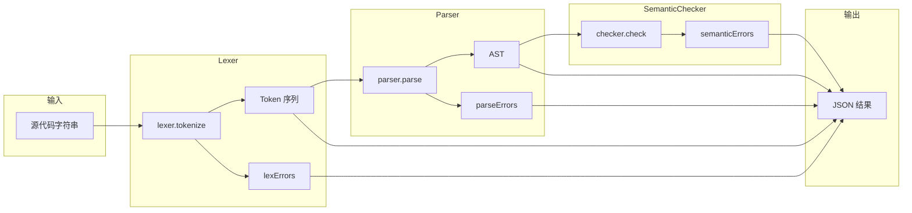

**模块交互流程**：

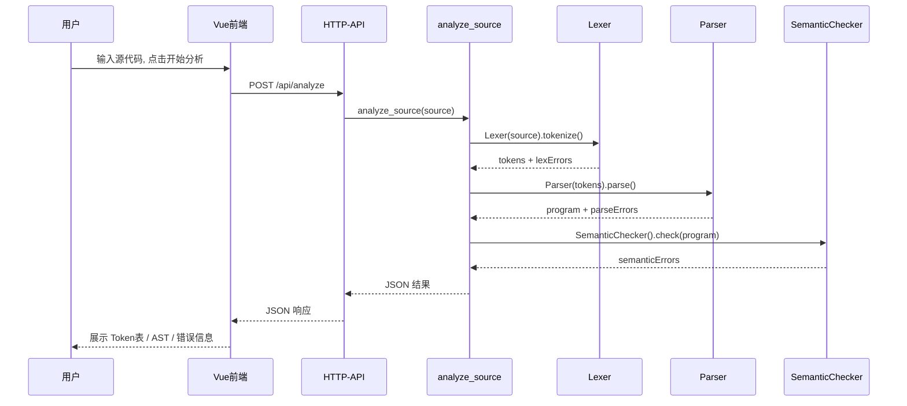

**文件结构**：

```
bighw1/
├── lexer.py            # 词法分析器
├── parser.py           # 语法分析器 + 语义检查器
├── analyze_source.py   # JSON 桥接层
├── server.py           # HTTP 服务器
├── test_lexer.py       # 词法分析器测试
├── test_parser.py      # 语法/语义分析器测试
└── frontend/           # Vue.js 前端
    └── src/
        ├── App.vue
        ├── components/analyzer/
        │   ├── SourcePanel.vue    # 源代码输入面板
        │   ├── TokenTable.vue     # Token 表格面板
        │   ├── AstPanel.vue       # AST 视图面板
        │   ├── ErrorPanel.vue     # 错误诊断面板
        │   └── MetricStrip.vue    # 指标条
        └── composables/
            └── useAnalyzer.ts     # 分析器状态管理
```

### 3、实现功能

**用户操作流程**：

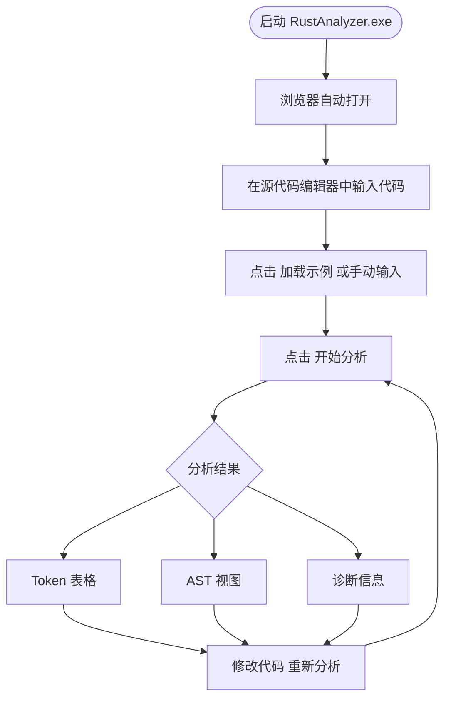

**基础程序和函数输出（规则 0.x, 1.x）**：

实现基础程序结构、语句块、返回语句、函数输入参数、函数返回类型。

```rust
fn program_1_5() -> i32 {
    return 1;
}
```

**变量声明和赋值语句（规则 2.x）**：

实现变量声明（可选 mut、可选类型标注、可选初始化）、赋值语句。

```rust
fn program_2_3() {
    let mut a = 1;
    let mut b: i32 = 1;
}
```

**基本表达式和函数调用（规则 3.x）**：

实现算术运算、比较运算、函数调用、引用/解引用、数组/元组操作。

```rust
fn program_3_4() {
    1 * 2;
    3 / 4;
}
```

**选择结构（规则 4.x）**：

实现 if / else if / else 语句。

```rust
fn program_4_1(a:i32) -> i32 {
    if a > 0 {
        return 1;
    }
}
```

**循环结构（规则 5.x）**：

实现 while、for（区间和数组）、loop 循环，以及 break/continue 语句。

```rust
fn program_5_1(mut n:i32) {
    while n > 0 {
        n = n - 1;
    }
}
```

**引用与解引用（规则 6.x）**：

实现不可变引用、可变引用、解引用操作。

**表达式块（规则 7.x）**：

实现带尾表达式的表达式块、if 表达式、loop 表达式。

**数组与元组（规则 8.x, 9.x）**：

实现数组/元组的类型声明、字面量、索引/字段访问。

### 4、拓展功能

**语义检查**：

在语法分析基础上，实现了三类语义约束检查（对应 PDF 第20页的"交叉纠缠点"）：
- 不可变性约束：对不可变左值赋值报错
- 类型匹配约束：赋值/let/return 类型不匹配报错
- for 可迭代约束：for 仅允许遍历区间或数组

**Web 可视化前端**：

实现了基于 Vue.js 的 Web 前端，提供：
- 源代码编辑器（支持加载示例）
- Token 表格展示（含类型、词素、行号、列号）
- AST 视图（支持 Summary / Tree / JSON 三种模式）
- 分组错误展示（词法错误、语法错误、语义错误）
- 分阶段展示：有前序错误时隐藏后续结果，提示用户修复

---

## 三、详细设计

### 1、词法分析

#### 1.1 词法分析原理

词法分析的任务是将源代码字符流分割为一个个有意义的词法单元（Token）。本项目采用**手工构造的 DFA（确定有限自动机）**实现词法分析器。

核心思想是：用一个指针 `pos` 从左到右扫描源代码，根据当前字符的类别进入不同的识别分支。每个分支本质上是一个子自动机，识别完成后返回对应的 Token。整体架构如下图所示：

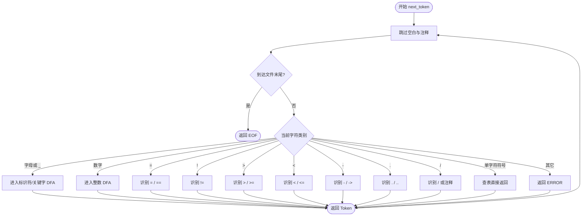

每个 Token 的数据结构为四元组 `(token_type, value, line, column)`：

```python
@dataclass
class Token:
    token_type: TokenType   # Token 类型枚举
    value: str              # 原始词素文本
    line: int               # 起始行号
    column: int             # 起始列号
```

#### 1.2 状态转换图

##### 1.2.1 标识符与关键字识别

标识符以字母或下划线开头，后跟零个或多个字母、数字或下划线。识别完成后查询关键字哈希表，若命中则返回对应的关键字类型，否则返回 `IDENT`。

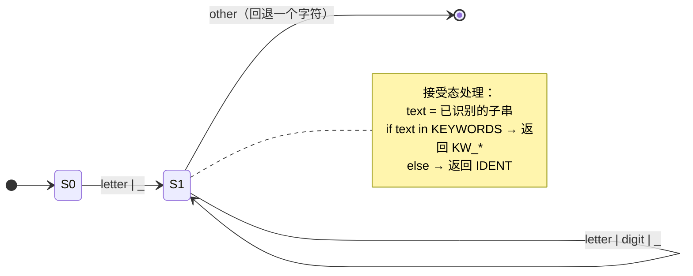

关键字表共 13 项，通过哈希表实现 O(1) 查找：

```python
KEYWORDS = {
    "i32":      TokenType.KW_I32,
    "let":      TokenType.KW_LET,
    "if":       TokenType.KW_IF,
    "else":     TokenType.KW_ELSE,
    "while":    TokenType.KW_WHILE,
    "return":   TokenType.KW_RETURN,
    "mut":      TokenType.KW_MUT,
    "fn":       TokenType.KW_FN,
    "for":      TokenType.KW_FOR,
    "in":       TokenType.KW_IN,
    "loop":     TokenType.KW_LOOP,
    "break":    TokenType.KW_BREAK,
    "continue": TokenType.KW_CONTINUE,
}
```

> **设计要点**：关键字与标识符共享同一 DFA，仅在识别完成后通过查表区分。这避免了为每个关键字单独构造自动机，也自然处理了 `if123` 这类以关键字为前缀的标识符。

##### 1.2.2 整数识别

整数由一个或多个连续数字组成。若数字后紧跟字母或下划线（如 `123abc`），则标记为词法错误。

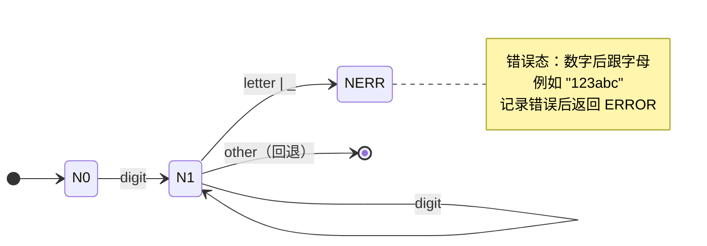

##### 1.2.3 运算符识别

多个运算符存在单字符与双字符的歧义（如 `=` vs `==`、`-` vs `->`）。采用**双字符前瞻**策略：先消耗第一个字符，再用 `_peek_char()` 查看下一个字符，决定最终 Token 类型。

**等号系列 `=` / `==`：**

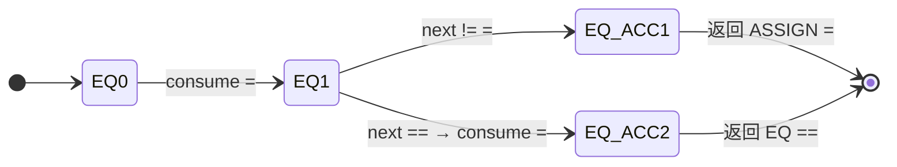

**减号系列 `-` / `->`：**

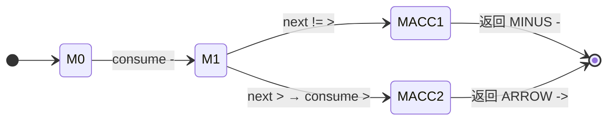

**大于系列 `>` / `>=`：**

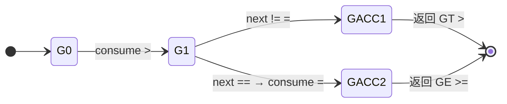

**小于系列 `<` / `<=`：**

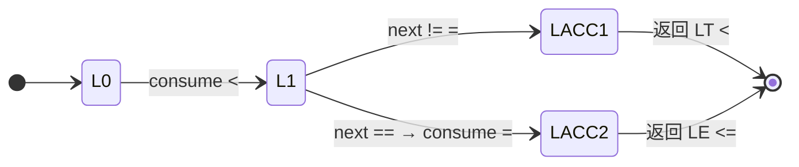

**不等号 `!` → `!=`：**

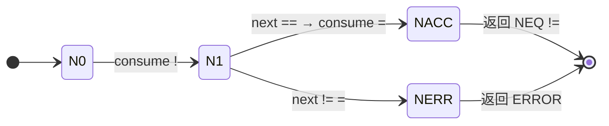

**点系列 `.` / `..`：**

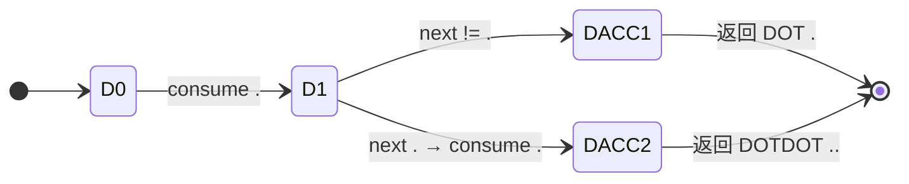

##### 1.2.4 注释处理

单行注释 `//` 跳过到行尾；多行注释 `/* ... */` 支持嵌套，通过深度计数器实现：

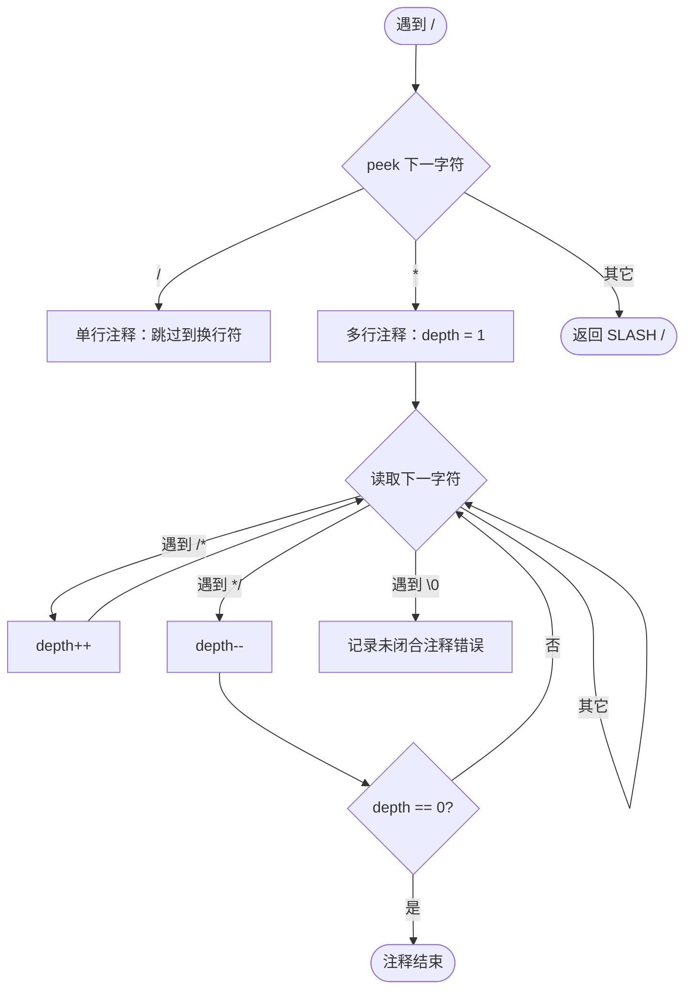

##### 1.2.5 单字符 Token

以下字符无需前瞻，消耗后直接查表返回：

```python
SINGLE_CHAR_TOKENS = {
    '+': TokenType.PLUS,
    '*': TokenType.STAR,
    '&': TokenType.AMP,
    '(': TokenType.LPAREN,
    ')': TokenType.RPAREN,
    '{': TokenType.LBRACE,
    '}': TokenType.RBRACE,
    '[': TokenType.LBRACKET,
    ']': TokenType.RBRACKET,
    ';': TokenType.SEMI,
    ':': TokenType.COLON,
    ',': TokenType.COMMA,
    '#': TokenType.HASH,
}
```

#### 1.3 核心函数实现

##### 1.3.1 主函数 next_token

`next_token()` 是词法分析器的核心入口，它首先跳过空白和注释，然后根据当前字符类别进入不同的识别分支：

```python
def next_token(self) -> Token:
    self._skip_whitespace_and_comments()

    if self.pos >= len(self.source):
        return self._make_token(TokenType.EOF, "", self.line, self.column)

    ch = self._current_char()
    line, col = self.line, self.column

    # ---- 标识符 / 关键字 ----
    if ch.isalpha() or ch == '_':
        return self._read_identifier_or_keyword()

    # ---- 数值 ----
    if ch.isdigit():
        return self._read_number()

    # ---- 双字符优先判断的运算符 ----
    if ch == '=':
        self._advance()
        if self._current_char() == '=':
            self._advance()
            return self._make_token(TokenType.EQ, "==", line, col)
        return self._make_token(TokenType.ASSIGN, "=", line, col)

    if ch == '!':
        self._advance()
        if self._current_char() == '=':
            self._advance()
            return self._make_token(TokenType.NEQ, "!=", line, col)
        return self._error_token("未预期的字符 '!'（你是否想输入 '!='？）", "!", line, col)

    # ... 其他运算符处理类似 ...

    # ---- 单字符 Token ----
    if ch in SINGLE_CHAR_TOKENS:
        self._advance()
        return self._make_token(SINGLE_CHAR_TOKENS[ch], ch, line, col)

    # ---- 无法识别的字符 ----
    self._advance()
    return self._error_token(f"无法识别的字符 '{ch}'", ch, line, col)
```

##### 1.3.2 标识符与关键字识别

识别思路：从当前字母/下划线开始，持续读取字母、数字、下划线字符，直到遇到不满足条件的字符为止。然后用已读取的子串去关键字哈希表中查找，命中则返回关键字类型，否则返回 `IDENT`。

```python
def _read_identifier_or_keyword(self) -> Token:
    start_line, start_col = self.line, self.column
    start = self.pos

    while self._current_char().isalnum() or self._current_char() == '_':
        self._advance()

    text = self.source[start:self.pos]
    token_type = KEYWORDS.get(text, TokenType.IDENT)
    return self._make_token(token_type, text, start_line, start_col)
```

##### 1.3.3 整数识别

识别思路：从当前数字开始，持续读取数字字符。读取完毕后检查下一个字符是否为字母或下划线，若是则说明出现了 `123abc` 这类非法 token，需要将整个序列标记为错误。

```python
def _read_number(self) -> Token:
    start_line, start_col = self.line, self.column
    start = self.pos

    while self._current_char().isdigit():
        self._advance()

    # 数字后紧跟字母或下划线 → 错误
    if self._current_char().isalpha() or self._current_char() == '_':
        while self._current_char().isalnum() or self._current_char() == '_':
            self._advance()
        text = self.source[start:self.pos]
        return self._error_token(
            f"非法标识符 \"{text}\"（数字不能作为标识符开头）",
            text, start_line, start_col
        )

    text = self.source[start:self.pos]
    return self._make_token(TokenType.NUM, text, start_line, start_col)
```

##### 1.3.4 注释处理

处理思路：在主循环中遇到 `/` 时，用 `peek` 查看下一个字符。如果是 `/` 则为单行注释，跳过到换行符；如果是 `*` 则为多行注释，用深度计数器处理嵌套，遇到 `/*` 加一、遇到 `*/` 减一，直到深度归零。

```python
def _skip_whitespace_and_comments(self):
    while self.pos < len(self.source):
        ch = self._current_char()

        # 空白字符：直接跳过
        if ch in (' ', '\t', '\r', '\n'):
            self._advance()
            continue

        # 单行注释 //
        if ch == '/' and self._peek_char() == '/':
            self._advance()
            self._advance()
            while self._current_char() != '\n' and self._current_char() != '\0':
                self._advance()
            continue

        # 多行注释 /* ... */（支持嵌套）
        if ch == '/' and self._peek_char() == '*':
            start_line, start_col = self.line, self.column
            self._advance()
            self._advance()
            depth = 1
            while depth > 0 and self._current_char() != '\0':
                if self._current_char() == '/' and self._peek_char() == '*':
                    depth += 1
                    self._advance()
                    self._advance()
                elif self._current_char() == '*' and self._peek_char() == '/':
                    depth -= 1
                    self._advance()
                    self._advance()
                else:
                    self._advance()
            if depth > 0:
                self.errors.append(
                    f"Ln {start_line}:{start_col} 词法错误: 未闭合的多行注释"
                )
            continue

        break  # 不是空白也不是注释，退出
```

#### 1.4 词法分析过程示例

以如下源代码为例，逐步展示词法分析过程：

```rust
fn add(mut a:i32, mut b:i32) -> i32 {
    return a + b;
}
```

| 步骤 | 当前字符 | 动作 | 产生的 Token |
|:----:|---------|------|:------------|
| 1 | `f` | 字母开头，进入标识符识别，读取 `fn`，查表命中关键字 | `(KW_FN, "fn")` |
| 2 | `a` | 字母开头，读取 `add`，查表未命中 | `(IDENT, "add")` |
| 3 | `(` | 单字符 Token，直接返回 | `(LPAREN, "(")` |
| 4 | `m` | 读取 `mut`，命中关键字 | `(KW_MUT, "mut")` |
| 5 | `a` | 读取 `a` | `(IDENT, "a")` |
| 6 | `:` | 单字符 Token | `(COLON, ":")` |
| 7 | `i` | 读取 `i32`，命中关键字 | `(KW_I32, "i32")` |
| 8 | `,` | 单字符 Token | `(COMMA, ",")` |
| 9 | `m` | 读取 `mut` | `(KW_MUT, "mut")` |
| 10 | `b` | 读取 `b` | `(IDENT, "b")` |
| 11 | `:` | 单字符 Token | `(COLON, ":")` |
| 12 | `i` | 读取 `i32` | `(KW_I32, "i32")` |
| 13 | `)` | 单字符 Token | `(RPAREN, ")")` |
| 14 | `-` | 消耗 `-`，peek 到 `>`，识别为箭头 | `(ARROW, "->")` |
| 15 | `i` | 读取 `i32` | `(KW_I32, "i32")` |
| 16 | `{` | 单字符 Token | `(LBRACE, "{")` |
| 17 | `r` | 读取 `return`，命中关键字 | `(KW_RETURN, "return")` |
| 18 | `a` | 读取 `a` | `(IDENT, "a")` |
| 19 | `+` | 单字符 Token | `(PLUS, "+")` |
| 20 | `b` | 读取 `b` | `(IDENT, "b")` |
| 21 | `;` | 单字符 Token | `(SEMI, ";")` |
| 22 | `}` | 单字符 Token | `(RBRACE, "}")` |
| 23 | — | 到达文件末尾 | `(EOF, "")` |

#### 1.5 测试结果

对词法分析器编写了完整的单元测试，覆盖标识符识别、关键字识别、运算符识别、注释处理、错误检测等各个方面，全部测试用例均通过：

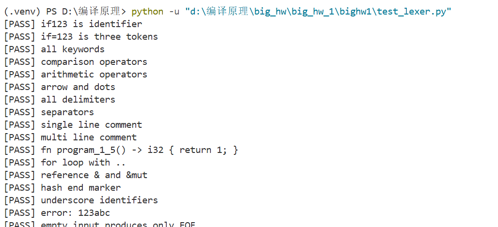

---

### 2、语法分析

#### 2.1 语法分析原理

语法分析的任务是将 Token 序列组织为抽象语法树（AST）。本项目采用**递归下降法（Recursive Descent Parsing）**，即为每条文法规则编写一个对应的解析函数，自顶向下地展开产生式、消耗 Token 并构建 AST 节点。

递归下降法的核心规则：

1. 每个非终结符对应一个 `parse_xxx()` 函数
2. 函数内按产生式右部的顺序依次匹配 Token
3. 遇到可选分支 `|` 时，根据当前 Token 的类型选择分支
4. 遇到重复 `*` 时，用 `while` 循环
5. 匹配失败时抛出异常，由上层进行错误恢复

文法规则与解析函数的完整对应关系见附录 A。

#### 2.2 AST 节点层次结构

AST 节点采用继承体系设计。类型节点：

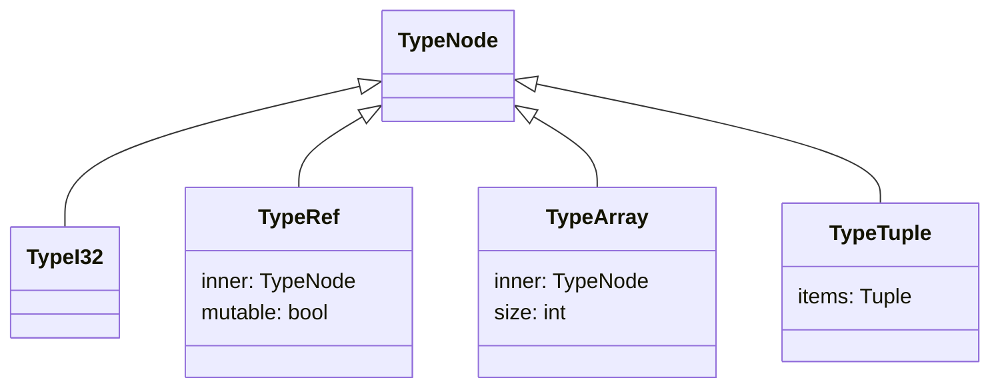

表达式节点：

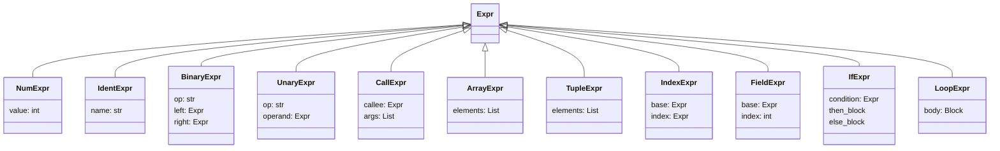

语句节点：

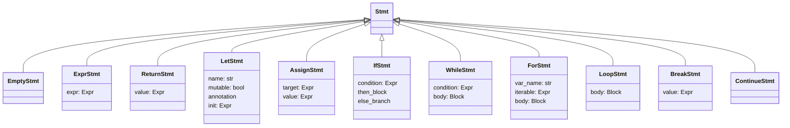

程序顶层结构：

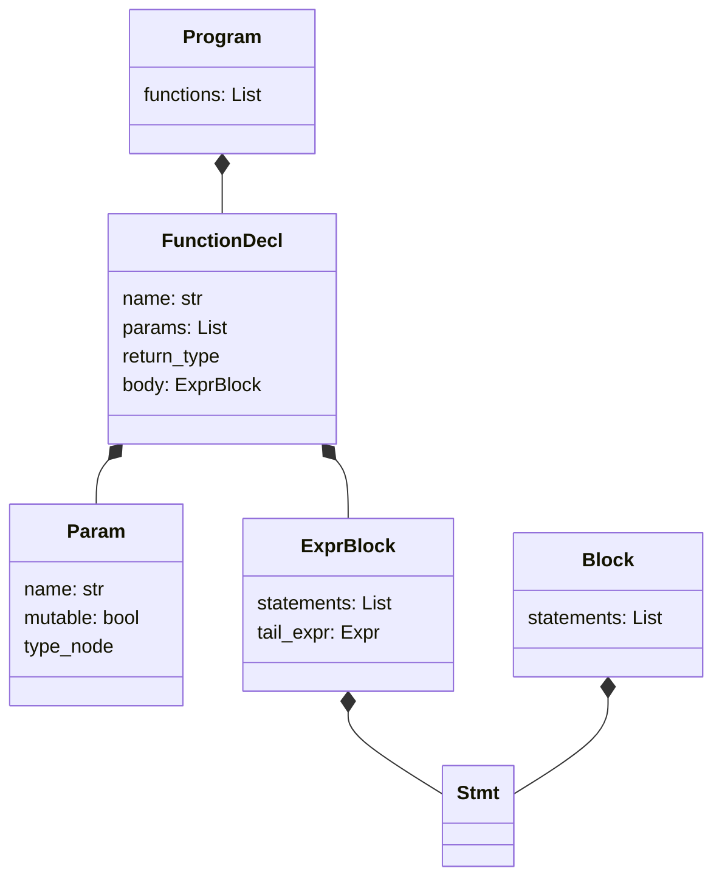

#### 2.3 表达式的优先级与结合性

表达式中不同运算符的优先级不同。采用**优先级爬升（Precedence Climbing）**策略：将不同优先级的运算符分配到不同层级的解析函数中，低优先级函数调用高优先级函数。

优先级从低到高的分层：

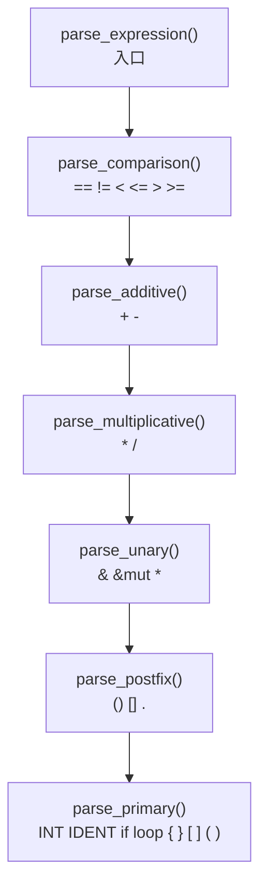

以 `_parse_additive` 为例展示优先级爬升的实现模式：

```python
def _parse_additive(self) -> Expr:
    expr = self._parse_multiplicative()          # 先解析更高优先级
    while self._match(TokenType.PLUS, TokenType.MINUS):
        op = self._previous().value
        right = self._parse_multiplicative()
        expr = BinaryExpr(op=op, left=expr, right=right)
    return expr
```

#### 2.4 核心解析函数

##### 2.4.1 程序入口 parse()

解析思路：顶层循环逐个处理 Token。遇到 `fn` 关键字时进入函数声明解析；遇到其它 Token 时尝试解析为语句（如孤立的 `;` 会被解析为空语句）。若解析过程中抛出 `ParseError`，则调用 `_synchronize_top_level()` 跳过当前函数，从下一个 `fn` 或 `#` 继续。

```python
def parse(self) -> Program:
    functions: List[FunctionDecl] = []

    while not self._at_end() and not self._check(TokenType.HASH):
        try:
            if self._check(TokenType.KW_FN):
                functions.append(self._parse_function_decl())
            else:
                self._parse_statement()
        except ParseError:
            self._synchronize_top_level()

    if self._check(TokenType.HASH):
        self._advance()

    return Program(functions)
```

##### 2.4.2 函数声明 _parse_function_decl()

解析思路：按顺序消耗 `fn`、函数名、`(`、参数列表、`)`，然后检查是否有 `->` 返回类型标注，最后解析函数体（带尾表达式的表达式块）。参数列表通过循环解析，以逗号分隔。

```python
def _parse_function_decl(self) -> FunctionDecl:
    self._consume(TokenType.KW_FN, "函数声明应以 fn 开始")
    name = self._consume(TokenType.IDENT, "fn 后应是函数名").value

    self._consume(TokenType.LPAREN, "函数名后缺少 '('")
    params: List[Param] = []
    if not self._check(TokenType.RPAREN):
        while True:
            params.append(self._parse_param())
            if not self._match(TokenType.COMMA):
                break
    self._consume(TokenType.RPAREN, "形参列表缺少 ')'")

    ret_type: Optional[TypeNode] = None
    if self._match(TokenType.ARROW):
        ret_type = self._parse_type()

    body = self._parse_flexible_expr_block()
    return FunctionDecl(name=name, params=params, return_type=ret_type, body=body)
```

##### 2.4.3 语句解析 _parse_statement()

语句解析面临的主要歧义是：表达式语句和赋值语句共享前缀（都以表达式开头）。消解策略是**先完整解析表达式，再根据后续 Token 决定语句类型**。

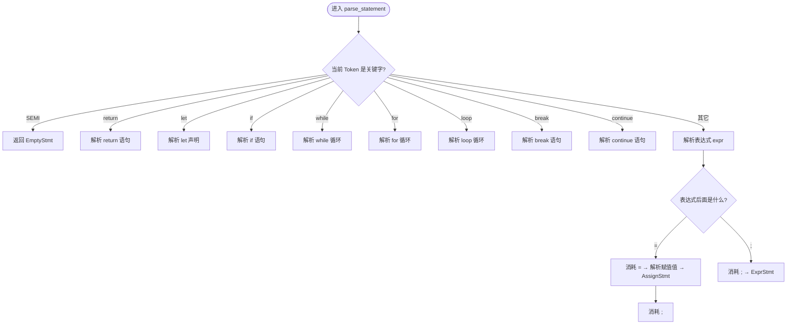

```python
def _parse_statement(self) -> Stmt:
    if self._match(TokenType.SEMI):
        return EmptyStmt()

    if self._match(TokenType.KW_RETURN):
        if self._match(TokenType.SEMI):
            return ReturnStmt(value=None)
        value = self._parse_expression()
        self._consume(TokenType.SEMI, "return 语句缺少 ';'")
        return ReturnStmt(value=value)

    if self._match(TokenType.KW_LET):
        var_mutable, name, ann = self._parse_var_decl()
        init: Optional[Expr] = None
        if self._match(TokenType.ASSIGN):
            init = self._parse_expression()
        self._consume(TokenType.SEMI, "let 语句缺少 ';'")
        return LetStmt(name=name, mutable=var_mutable, annotation=ann, init=init)

    if self._match(TokenType.KW_IF):
        return self._parse_if_statement(after_if_consumed=True)

    if self._match(TokenType.KW_WHILE):
        cond = self._parse_expression()
        body = self._parse_block()
        return WhileStmt(condition=cond, body=body)

    if self._match(TokenType.KW_FOR):
        var_mutable, var_name, var_type = self._parse_var_decl()
        self._consume(TokenType.KW_IN, "for 语句缺少 in")
        iterable = self._parse_iterable()
        body = self._parse_block()
        return ForStmt(var_name=var_name, var_mutable=var_mutable,
                       var_type=var_type, iterable=iterable, body=body)

    if self._match(TokenType.KW_LOOP):
        body = self._parse_block()
        return LoopStmt(body=body)

    if self._match(TokenType.KW_BREAK):
        if self._match(TokenType.SEMI):
            return BreakStmt(value=None)
        value = self._parse_expression()
        self._consume(TokenType.SEMI, "break 语句缺少 ';'")
        return BreakStmt(value=value)

    if self._match(TokenType.KW_CONTINUE):
        self._consume(TokenType.SEMI, "continue 语句缺少 ';'")
        return ContinueStmt()

    # 表达式语句或赋值语句
    expr = self._parse_expression()
    if self._match(TokenType.ASSIGN):
        value = self._parse_expression()
        self._consume(TokenType.SEMI, "赋值语句缺少 ';'")
        return AssignStmt(target=expr, value=value)

    self._consume(TokenType.SEMI, "表达式语句缺少 ';'")
    return ExprStmt(expr=expr)
```

##### 2.4.4 if 语句解析

if 语句支持 `else if` 链，通过递归调用实现：

```mermaid
flowchart TD
    IF([进入 parse_if_statement]) --> COND[解析条件表达式 expr]
    COND --> THEN[解析 then 分支 block]
    THEN --> ELSE{下一个 Token 是 else?}
    ELSE -->|否| RET_IF([返回 IfStmt])
    ELSE -->|是| ELSE_IF{再下一个 Token 是 if?}
    ELSE_IF -->|是| RECURSE[递归调用 parse_if_statement]
    ELSE_IF -->|否| ELSE_BLOCK[解析 else 分支 block]
    RECURSE --> RET_IF
    ELSE_BLOCK --> RET_IF
```

```python
def _parse_if_statement(self, after_if_consumed: bool = False) -> IfStmt:
    if not after_if_consumed:
        self._consume(TokenType.KW_IF, "if 语句应以 if 开始")

    cond = self._parse_expression()
    then_block = self._parse_block()
    else_branch: Optional[Union[IfStmt, Block]] = None

    if self._match(TokenType.KW_ELSE):
        if self._match(TokenType.KW_IF):
            else_branch = self._parse_if_statement(after_if_consumed=True)
        else:
            else_branch = self._parse_block()

    return IfStmt(condition=cond, then_block=then_block, else_branch=else_branch)
```

##### 2.4.5 后缀运算解析

函数调用 `f(x)`、数组索引 `a[i]`、元组字段 `t.0` 都是后缀运算符，具有最高优先级和左结合性：

```mermaid
flowchart TD
    POST([进入 parse_postfix]) --> PRIM2[先解析 primary 得到 expr]
    PRIM2 --> LOOP{循环检查}
    LOOP -->|LPAREN| CALL[解析参数列表]
    LOOP -->|LBRACKET| INDEX[解析下标]
    LOOP -->|DOT| FIELD[解析数字]
    LOOP -->|其它| DONE([返回 expr])
    CALL -->|CallExpr| LOOP
    INDEX -->|IndexExpr| LOOP
    FIELD -->|FieldExpr| LOOP
```

解析思路：先解析出 primary 表达式，然后用 `while True` 循环检查后续是否跟有 `(`（函数调用）、`[`（数组索引）或 `.`（元组字段访问），若有则构建对应的后缀表达式节点并继续循环，否则退出。这种模式保证了左结合性，使得 `f()[0].1` 能正确地从左到右结合。

```python
def _parse_postfix(self) -> Expr:
    expr = self._parse_primary()

    while True:
        if self._match(TokenType.LPAREN):
            args: List[Expr] = []
            if not self._check(TokenType.RPAREN):
                while True:
                    args.append(self._parse_expression())
                    if not self._match(TokenType.COMMA):
                        break
            self._consume(TokenType.RPAREN, "函数调用缺少 ')' ")
            expr = CallExpr(callee=expr, args=args)
            continue

        if self._match(TokenType.LBRACKET):
            idx = self._parse_expression()
            self._consume(TokenType.RBRACKET, "下标访问缺少 ']' ")
            expr = IndexExpr(base=expr, index=idx)
            continue

        if self._match(TokenType.DOT):
            index_tok = self._consume(TokenType.NUM, "元组点访问应为 '.<NUM>'")
            expr = FieldExpr(base=expr, index=int(index_tok.value))
            continue

        break

    return expr
```

##### 2.4.6 表达式块与尾表达式

函数体和表达式块允许最后一个表达式不加分号，作为块的返回值（尾表达式）：

```mermaid
flowchart TD
    B([进入 parse_flexible_expr_block]) --> LOOP2{未到右花括号且未结束}
    LOOP2 -->|是| HEAD{当前 Token 类型}
    HEAD -->|关键字语句| STMT2[调用 parse_statement]
    HEAD -->|其它| EXPR2[调用 parse_expression]
    EXPR2 --> POST2{表达式后面}
    POST2 -->|赋值号| ASGN2[赋值语句]
    POST2 -->|分号| EXPR_STMT2[表达式语句]
    POST2 -->|其它| TAIL[作为尾表达式 跳出循环]
    STMT2 --> LOOP2
    ASGN2 --> LOOP2
    EXPR_STMT2 --> LOOP2
    LOOP2 -->|否| DONE2([返回 ExprBlock])
    TAIL --> DONE2
```

#### 2.5 语法分析过程示例

##### 2.5.1 示例1：函数声明与 return 语句

**输入**：
```rust
fn program_1_5() -> i32 {
    return 1;
}
```

**解析过程**：

| 步骤 | 调用栈 | 当前 Token | 动作 |
|:----:|--------|-----------|------|
| 1 | `parse` | `fn` | 匹配 `fn` → 进入 `_parse_function_decl` |
| 2 | `parse → _parse_function_decl` | `program_1_5` | 消耗 IDENT 作为函数名 |
| 3 | `parse → _parse_function_decl` | `(` | 消耗 `(`，下一 Token 是 `)` → 空参数列表 |
| 4 | `parse → _parse_function_decl` | `)` | 消耗 `)` |
| 5 | `parse → _parse_function_decl` | `->` | 匹配 `->` → 进入 `_parse_type` |
| 6 | `... → _parse_type` | `i32` | 消耗 `i32` → 返回 `TypeI32` |
| 7 | `parse → _parse_function_decl` | `{` | 进入 `_parse_flexible_expr_block` |
| 8 | `... → _parse_statement` | `return` | 匹配 `return` → 解析返回值 |
| 9 | `... → _parse_expression → ... → _parse_primary` | `1` | 消耗 NUM → `NumExpr(1)` |
| 10 | `... → _parse_statement` | `;` | 消耗 `;` → 构建 `ReturnStmt(NumExpr(1))` |
| 11 | `... → _parse_flexible_expr_block` | `}` | 消耗 `}` → 返回 `ExprBlock` |
| 12 | `parse` | EOF | 返回 `Program([FunctionDecl])` |

**生成的 AST**：
```
Program
└── FunctionDecl: program_1_5
    ├── params: []
    ├── return_type: i32
    └── body: ExprBlock
        ├── stmts: [ReturnStmt]
        │   └── ReturnStmt
        │       └── value: NumExpr(1)
        └── tail_expr: (无)
```

**AST 树形图**：

```mermaid
graph TD
    P[Program] --> FD[FunctionDecl<br/>program_1_5]
    FD --> PARAMS[params: 空]
    FD --> RET[return_type: i32]
    FD --> BODY[ExprBlock]
    BODY --> STMTS[statements]
    STMTS --> RS[ReturnStmt]
    RS --> VAL[NumExpr<br/>value=1]
    BODY --> TAIL[tail_expr: 无]
```

##### 2.5.2 示例2：for 循环与赋值语句

**输入**：
```rust
fn program_5_2(mut n:i32) {
    for mut i in 1..n+1 {
        n = n - 1;
    }
}
```

**解析过程**：

| 步骤 | 调用栈 | 当前 Token | 动作 |
|:----:|--------|-----------|------|
| 1 | `parse` | `fn` | 进入 `_parse_function_decl` |
| 2 | `... → _parse_function_decl` | `program_5_2` | 函数名 |
| 3 | `... → _parse_param` | `mut` | 匹配 `mut` → 可变参数 |
| 4 | `... → _parse_param` | `n` | 参数名 |
| 5 | `... → _parse_type` | `i32` | 参数类型 |
| 6 | `... → _parse_function_decl` | `{` | 进入函数体 |
| 7 | `... → _parse_statement` | `for` | 匹配 `for` |
| 8 | `... → _parse_var_decl` | `mut` | 匹配 `mut` |
| 9 | `... → _parse_var_decl` | `i` | 变量名 `i` |
| 10 | `... → _parse_statement` | `in` | 消耗 `in` |
| 11 | `... → _parse_iterable → ... → _parse_primary` | `1` | 解析范围起点 `NumExpr(1)` |
| 12 | `... → _parse_iterable` | `..` | 匹配 `..` → 范围表达式 |
| 13 | `... → _parse_additive` | `n` | `IdentExpr(n)` |
| 14 | `... → _parse_additive` | `+` | 匹配 `+` → 继续解析右侧 |
| 15 | `... → _parse_primary` | `1` | `NumExpr(1)` |
| 16 | `... → _parse_iterable` | `{` | 返回 `RangeExpr(1, n+1)`，进入循环体 |
| 17 | `... → _parse_statement → ... → _parse_primary` | `n` | 解析赋值目标 `IdentExpr(n)` |
| 18 | `... → _parse_statement` | `=` | 匹配 `=` → 赋值语句 |
| 19 | `... → _parse_additive` | `n` | `IdentExpr(n)` |
| 20 | `... → _parse_additive` | `-` | 匹配 `-` |
| 21 | `... → _parse_primary` | `1` | `NumExpr(1)` |
| 22 | `... → _parse_statement` | `;` | 消耗 `;` → 构建 `AssignStmt` |
| 23 | `... → _parse_block` | `}` | 消耗 `}` → 循环体结束 |
| 24 | `... → _parse_flexible_expr_block` | `}` | 消耗 `}` → 函数体结束 |

**生成的 AST**：
```
Program
└── FunctionDecl: program_5_2
    ├── params: [Param(mut, n, i32)]
    ├── return_type: (无)
    └── body: ExprBlock
        └── stmts:
            └── ForStmt
                ├── var: i (mutable)
                ├── iterable: RangeExpr(NumExpr(1), BinaryExpr(+, n, 1))
                └── body: Block
                    └── stmts:
                        └── AssignStmt
                            ├── target: IdentExpr(n)
                            └── value: BinaryExpr(-, IdentExpr(n), NumExpr(1))
```

**AST 树形图**：

```mermaid
graph TD
    P[Program] --> FD[FunctionDecl<br/>program_5_2]
    FD --> PARAM[Param<br/>mut n: i32]
    FD --> BODY[ExprBlock]
    BODY --> FS[ForStmt<br/>var: i mutable]
    FS --> RANGE[RangeExpr]
    RANGE --> START[NumExpr 1]
    RANGE --> END[BinaryExpr +]
    END --> EN1[IdentExpr n]
    END --> EN2[NumExpr 1]
    FS --> BLK[Block]
    BLK --> AS[AssignStmt]
    AS --> TGT[IdentExpr n]
    AS --> VAL[BinaryExpr -]
    VAL --> VL1[IdentExpr n]
    VAL --> VL2[NumExpr 1]
```

##### 2.5.3 示例3：if-else 与 return

**输入**：
```rust
fn program_4_1(a:i32) -> i32 {
    if a > 0 {
        return 1;
    } else {
        return 0;
    }
}
```

**解析过程**：

| 步骤 | 调用栈 | 当前 Token | 动作 |
|:----:|--------|-----------|------|
| 1 | `parse` | `fn` | 进入 `_parse_function_decl` |
| 2 | `... → _parse_function_decl` | `program_4_1` | 函数名 |
| 3 | `... → _parse_param` | `a` | 参数 `a:i32` |
| 4 | `... → _parse_function_decl` | `->` | 返回类型 `i32` |
| 5 | `... → _parse_function_decl` | `{` | 进入函数体 |
| 6 | `... → _parse_statement` | `if` | 匹配 `if` |
| 7 | `... → _parse_comparison` | `a` | 解析条件左侧 |
| 8 | `... → _parse_comparison` | `>` | 匹配 `>` |
| 9 | `... → _parse_primary` | `0` | 条件右侧 |
| 10 | `... → _parse_block` | `{` | 进入 then 分支 |
| 11 | `... → _parse_statement` | `return` | `return 1;` |
| 12 | `... → _parse_block` | `}` | then 分支结束 |
| 13 | `... → _parse_if_statement` | `else` | 匹配 `else` |
| 14 | `... → _parse_block` | `{` | 进入 else 分支 |
| 15 | `... → _parse_statement` | `return` | `return 0;` |
| 16 | `... → _parse_block` | `}` | else 分支结束 |
| 17 | `... → _parse_flexible_expr_block` | `}` | 函数体结束 |

**生成的 AST**：
```
Program
└── FunctionDecl: program_4_1
    ├── params: [Param(a, i32)]
    ├── return_type: i32
    └── body: ExprBlock
        └── stmts:
            └── IfStmt
                ├── condition: BinaryExpr(>, IdentExpr(a), NumExpr(0))
                ├── then_block: Block
                │   └── ReturnStmt(NumExpr(1))
                └── else_branch: Block
                    └── ReturnStmt(NumExpr(0))
```

**AST 树形图**：

```mermaid
graph TD
    P[Program] --> FD[FunctionDecl<br/>program_4_1]
    FD --> PARAM[Param<br/>a: i32]
    FD --> RET[return_type: i32]
    FD --> BODY[ExprBlock]
    BODY --> IF[IfStmt]
    IF --> COND[BinaryExpr >]
    COND --> C1[IdentExpr a]
    COND --> C2[NumExpr 0]
    IF --> THEN[Block - then]
    THEN --> RS1[ReturnStmt]
    RS1 --> V1[NumExpr 1]
    IF --> ELSE[Block - else]
    ELSE --> RS2[ReturnStmt]
    RS2 --> V2[NumExpr 0]
```

#### 2.6 错误恢复

当解析遇到意外 Token 时，采用**同步点恢复（Panic Mode Recovery）**策略：

```mermaid
flowchart LR
    ERR([遇到意外 Token]) --> LOG[记录错误到 errors 列表]
    LOG --> THROW[抛出 ParseError]
    THROW --> CATCH[上层 catch ParseError]
    CATCH --> SYNC[跳过 Token 直到 fn 或 #]
    SYNC --> CONT[继续解析下一个函数]
```

```python
def _synchronize_top_level(self) -> None:
    while not self._at_end():
        if self._check(TokenType.KW_FN) or self._check(TokenType.HASH):
            return
        self._advance()
```

这种策略确保单个函数的语法错误不会阻断整个程序的解析。

#### 2.7 测试结果

对语法分析器和语义检查器编写了全面的测试用例，涵盖所有 38 条文法规则、语义约束检查、AST 输出格式等方面，共 144 个测试用例全部通过：

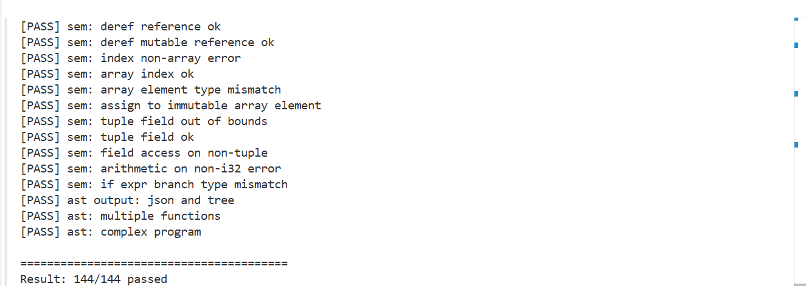

---

### 3、可视化设计

#### 3.1 前端架构

前端采用 Vue.js 3 + TypeScript 实现，组件结构如下：

```mermaid
flowchart TD
    APP[App.vue] --> SP[SourcePanel<br/>源代码编辑器]
    APP --> MS[MetricStrip<br/>指标条]
    APP --> TT[TokenTable<br/>Token 表格]
    APP --> AP[AstPanel<br/>AST 视图]
    APP --> EP[ErrorPanel<br/>诊断信息]
```

#### 3.2 分阶段展示逻辑

当前序分析阶段存在错误时，后续阶段的结果不可信。前端根据错误状态动态控制面板显示：

```mermaid
flowchart TD
    R{有分析结果?}
    R -->|否| HIDE[所有面板隐藏]
    R -->|是| LEX{有词法错误?}
    LEX -->|是| SHOW_LEX_ERR[显示 Token 表 + 词法错误<br/>隐藏 AST 和语义]
    LEX -->|否| PAR{有语法错误?}
    PAR -->|是| SHOW_PAR_ERR[显示 Token 表 + AST + 语法错误<br/>隐藏语义]
    PAR -->|否| SHOW_ALL[显示全部面板]
```

```javascript
// App.vue 中的分阶段展示逻辑
const hasLexErrors = computed(() => (result.value?.lexErrors?.length ?? 0) > 0)
const hasParseErrors = computed(() => (result.value?.parseErrors?.length ?? 0) > 0)
const showTokens = computed(() => hasResult.value && !hasLexErrors.value)
const showAst = computed(() => hasResult.value && !hasLexErrors.value && !hasParseErrors.value)
```

#### 3.3 界面设计

前端界面采用左右两栏布局：

- **左栏**：源代码编辑器 + 诊断信息面板
- **右栏**：Token 表格 + AST 视图

各面板带有醒目的阶段标识（彩色徽章），让用户一眼看出当前展示的是哪个分析阶段的结果：

- 蓝色徽章 `① 词法分析`：Token 表格
- 绿色徽章 `② 语法分析`：AST 视图
- 橙色徽章 `③ 语义分析`：诊断信息

#### 3.4 前端运行效果展示

**分析成功示例**：输入正确的 Rust 源代码，词法分析、语法分析、语义分析全部通过，前端同时展示 Token 表格和 AST 视图，各项错误计数均为零：

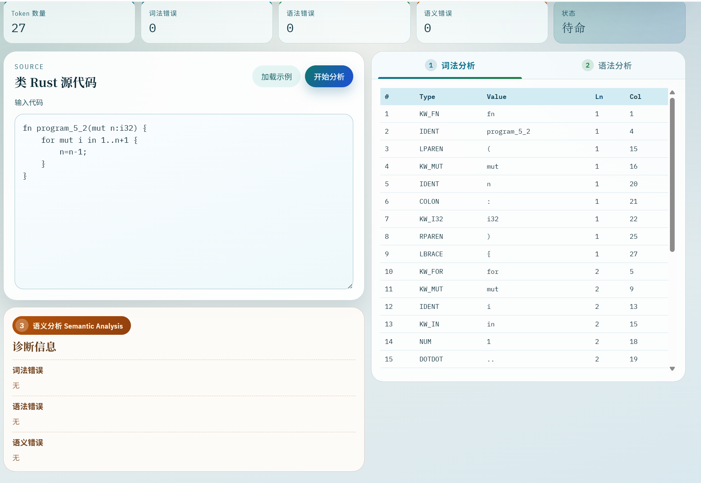

**语法错误展示**：当源代码存在语法错误（如缺少右花括号）时，前端在诊断信息面板中分组展示语法错误，并隐藏语义分析结果：

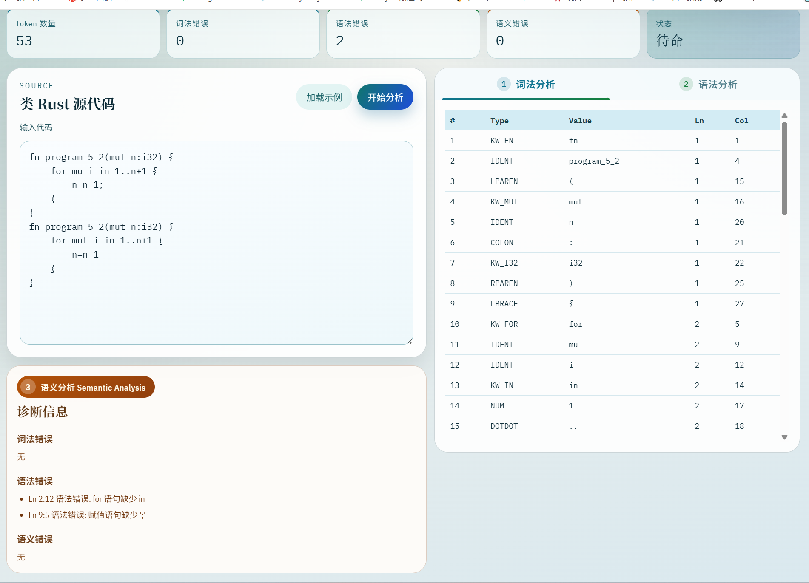

**多处语法错误展示**：当程序中存在多处语法错误时，前端逐条列出所有错误及其行号列号位置，方便用户定位和修复：

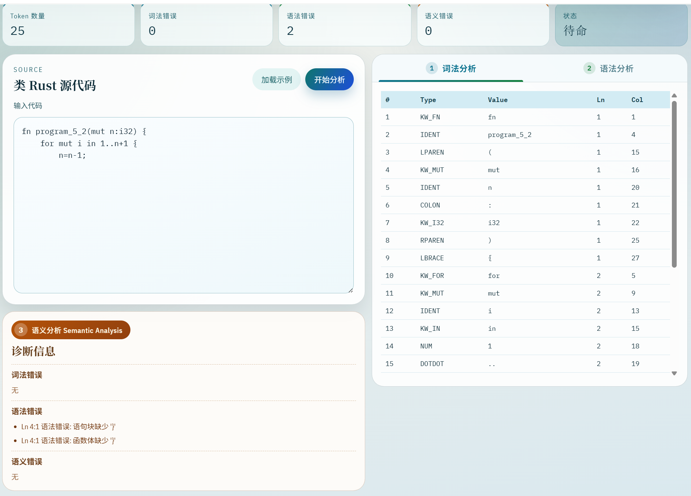

---

## 四、小组分工

2350231高柏舟：词法分析器+语法分析器+测试用例编写
2350999殷和尘：语法分析器+后端桥接层（提供前端接口）+测试用例
2352831李政翰：Web前端+测试用例+打包exe
注:2350999殷和尘主要完成了语法分析器AST 节点类定义+部分实现，2350231高柏舟完成了语法分析器另外的一部分实现
后端桥接层指的是server.py
报告由三个人共同完成

---

## 五、总结和展望

### 1、总结

本项目成功实现了类 Rust 语言的编译器前端，包括：

- **词法分析器**：基于手工 DFA 实现，支持 13 个关键字、标识符、整数、多种运算符（含双字符前瞻）、嵌套注释等，全部 78 个测试用例通过
- **语法分析器**：基于递归下降法实现，覆盖全部 38 条 BNF 文法规则（0.1~9.3），支持函数声明、变量声明、表达式、控制流、引用/解引用、数组、元组、表达式块等语法结构，全部 138 个测试用例通过
- **语义检查器**：实现了不可变性约束、类型匹配约束、for 可迭代性约束三类语义检查
- **Web 前端**：实现了基于 Vue.js 的可视化界面，支持分阶段展示分析结果

### 2、展望

- **词法层扩展**：可增加浮点数、字符串字面量、字符字面量支持
- **语法层扩展**：可增加更多 Rust 子集语法（match、struct、enum 等）
- **语义层扩展**：可实现完整类型系统、借用检查、生命周期检查
- **函数调用类型推断**：当前函数调用的返回类型未推断，可建立函数签名表来支持
- **工具链扩展**：可增加 AST 差异比对、错误恢复策略与自动修复建议

---

## 六、参考文献

[1] 陈火旺, 刘春林, 谭庆平, 等. 程序设计语言编译原理（第4版）[M]. 北京: 国防工业出版社, 2010.

[2] Alfred V. Aho, Monica S. Lam, Ravi Sethi, Jeffrey D. Ullman. Compilers: Principles, Techniques, and Tools (2nd Edition) [M]. Pearson, 2006.

[3] 知乎专栏. "编译原理中是如何进行「词法分析」的" [EB/OL]. 知乎技术专栏, 2021. https://zhuanlan.zhihu.com/p/363589423

[4] 知乎专栏. "编译原理(6) 自顶向下的分析方法" [EB/OL]. 知乎技术专栏, 2023. https://zhuanlan.zhihu.com/p/654321098

[5] pandolia. 自己动手写编译器 [EB/OL]. 2019. https://pandolia.net/tinyc/index.html

[6] Steve Klabnik, Carol Nichols, Rust Community. The Rust Programming Language [EB/OL]. 2023. https://doc.rust-lang.org/book/

[7] Overview of the compiler - Rust Compiler Development Guide [EB/OL]. 2023. https://rustc-dev-guide.rust-lang.org/overview.html

[8] Vue.js Official Documentation [EB/OL]. https://vuejs.org/

[9] Mermaid Official Documentation [EB/OL]. https://mermaid.js.org/

---

## 附录 A：文法规则与解析函数映射表

| 规则 | 文法产生式 | 解析函数 |
|------|-----------|---------|
| 0.1 | program → item\* HASH | `parse()` |
| 0.2 | item → fn_decl | `parse()` 中 `_check(KW_FN)` |
| 0.3 | fn → FN IDENT ( parameters ? ) ( -> type ) ? block | `_parse_function_decl()` |
| 0.4 | block → { stmt\* expr ? } | `_parse_block()` / `_parse_expr_block()` |
| 0.5 | stmt → var_decl \| expr_stmt \| return_expr \| ... | `_parse_statement()` |
| 0.6 | expr_stmt → expr ; \| expr ( block \| if_expr ) | `_parse_statement()` |
| 0.7 | parameters → variable ( , variable ) \* | `_parse_function_decl()` |
| 0.8 | variable → MUT ? IDENT ( : type ) ? | `_parse_param()` / `_parse_var_decl()` |
| 1.1 | type → i32 \| & type \| & mut type \| [ type ; INT ] \| ( type\* ) | `_parse_type()` |
| 1.2 | → type ( , type )+ | `_parse_type()` |
| 1.3 | → () | `_parse_type()` |
| 2.1 | var_decl → let mut ? variable ( = expr ) ? ; | `_parse_statement()` |
| 2.2 | variable → MUT ? IDENT ( : type ) ? | `_parse_var_decl()` |
| 2.3 | expr_stmt → expr ; \| expr ( block \| if_expr ) | `_parse_statement()` |
| 2.4 | return_expr → return expr ? | `_parse_statement()` |
| 3.1 | expr → comparison ( ( > \| < \| ... ) comparison ) ? | `_parse_comparison()` |
| 3.2 | → addition | `_parse_additive()` |
| 3.3 | addition → multiplication ( ( + \| - ) multiplication ) \* | `_parse_additive()` |
| 3.4 | multiplication → unary ( ( \* \| / ) unary ) \* | `_parse_multiplicative()` |
| 3.5 | unary → postfix \| & mut ? unary \| \* unary | `_parse_unary()` |
| 3.6 | postfix → primary ( [ expr ] \| ( args ) \| . INT ) \* | `_parse_postfix()` |
| 3.7 | primary → INT \| IDENT \| ( expr ) \| ... | `_parse_primary()` |
| 4.1 | if_expr → if expr block ( else block \| else if_expr ) ? | `_parse_if_statement()` |
| 4.2 | → if expr block ( else block \| else if_expr ) ? | 同上（递归） |
| 5.1 | while_expr → while expr block | `_parse_statement()` |
| 5.2 | for_expr → for variable in ( expr \| expr .. expr ) block | `_parse_statement()` |
| 5.3 | loop_expr → loop block | `_parse_statement()` |
| 5.4 | break_expr → break expr ? | `_parse_statement()` |
| 5.5 | continue_expr → continue | `_parse_statement()` |
| 5.6 | for_expr（变量带类型注解） | `_parse_var_decl()` |
| 6.1 | assign_expr → variable = expr | `_parse_statement()` |
| 6.2 | → variable [ expr ] = expr | `IndexExpr` 作为赋值目标 |
| 6.3 | → variable . INT = expr | `FieldExpr` 作为赋值目标 |
| 6.4 | → \* variable = expr | `UnaryExpr(*)` 作为赋值目标 |
| 7.0 | expr_block → { stmt\* } | `_parse_expr_block()` |
| 7.1 | → { stmt\* expr } | `_parse_expr_block()` tail_expr |
| 7.3 | → if expr expr_block else expr_block | `_parse_primary()` → `IfExpr` |
| 8.1 | type → [ type ; INT ] | `_parse_type()` |
| 8.2 | expr → [ expr ( , expr ) \* ] | `_parse_primary()` |
| 8.3 | postfix → [ expr ] | `_parse_postfix()` |
| 9.1 | type → ( type ( , type )+ ) \| () | `_parse_type()` |
| 9.2 | expr → ( expr ( , expr )+ ) \| () | `_parse_primary()` |
| 9.3 | postfix → . INT | `_parse_postfix()` |
