---
puppeteer:
  displayHeaderFooter: true
  headerTemplate: '<div style="font-size: 9px; width: 100%; text-align: center; color: #999;">编译原理大作业二报告</div>'
  footerTemplate: '<div style="font-size: 9px; width: 100%; text-align: center; color: #999;"><span class="pageNumber"></span> / <span class="totalPages"></span></div>'
  margin:
    top: '50px'
    bottom: '50px'
---
# 编译原理大作业2 — 语义分析与中间代码生成实验报告

## 目录

- [一、实验概述](#一实验概述)
  - [1、目的与意义](#1目的与意义)
  - [2、主要任务](#2主要任务)
  - [3、需求分析](#3需求分析)
- [二、使用说明](#二使用说明)
  - [1、环境配置](#1环境配置)
  - [2、整体设计](#2整体设计)
  - [3、相对大作业1的演进](#3相对大作业1的演进)
- [三、详细设计](#三详细设计)
  - [1、语义分析](#1语义分析)
  - [2、中间代码生成](#2中间代码生成)
  - [3、可视化设计](#3可视化设计)
- [四、运行效果展示](#四运行效果展示)
- [五、测试结果](#五测试结果)
- [六、小组分工](#六小组分工)
- [七、总结和展望](#七总结和展望)
- [八、参考文献](#八参考文献)

## 一、实验概述

### 1、目的与意义

大作业1完成了类 Rust 语言编译器的**前端骨架**——词法分析与语法分析，能够把源代码转化为 Token 序列与抽象语法树（AST）。本次大作业2在此基础上继续向编译器的中后端推进，核心目标是：

- **掌握语义分析原理与实现**：理解符号表、作用域、类型系统的概念，在 AST 上完成静态语义检查（类型检查、可变性检查、初始化检查、函数调用检查等）
- **掌握中间代码生成原理与实现**：理解中间表示（IR）的作用，掌握以**四元式（Quadruple）**为目标的语法制导翻译，特别是控制流（if / while / for / loop）的标号与跳转翻译
- **理解编译器各阶段的衔接**：认识 AST 作为语义分析与代码生成的公共数据结构，体会"前端 → 语义 → IR"的数据流

### 2、主要任务

**语义分析器（SemanticAnalyzer）**：
- 构建分层作用域的符号表，记录变量的可变性、类型与初始化状态
- 设计类型系统（`i32`、引用、数组、元组）并实现类型推断与类型相容性判定
- 实现完整的静态语义检查：变量重复定义、未定义变量、**未初始化变量使用**、不可变赋值、类型不匹配、`for` 可迭代性、`break`/`continue` 位置、函数重复定义、函数调用参数检查等
- 为每条诊断附带精确的行号、列号

**中间代码生成器（四元式）**：
- 设计四元式 `(op, arg1, arg2, result)` 数据结构
- 实现表达式翻译（算术 / 比较 / 一元 / 函数调用 / 数组 / 元组 / 下标 / 字段）与临时变量分配
- 实现语句翻译与控制流翻译（`if` / `while` / `for` / `loop` / `break` / `continue`），采用标号 + 条件跳转 `jz` / 无条件跳转 `jmp`
- 实现函数调用约定（`arg` / `call` / `param` / `return`）

**前端可视化扩展**：
- 在大作业1的"词法 / 语法"两个标签页之后，新增"语义分析"标签，展示生成的四元式中间代码表
- 诊断信息面板新增语义错误分组

### 3、需求分析

**输入**：包含类 Rust 源代码的文本。

**语义分析**：在语法分析产生的 AST 上遍历检查，确认程序不仅"语法正确"，而且"语义合法"（类型自洽、变量先声明后使用、赋值目标可变等），并输出带位置的诊断信息。

**中间代码生成**：在语义合法的前提下，将 AST 翻译为线性的四元式序列，作为后续目标代码生成或优化的基础。

**输出**：语义错误列表（含行列号）；四元式中间代码序列；函数签名表。前序阶段（词法 / 语法）有错时，不进行后续阶段。

---

## 二、使用说明

### 1、环境配置

**Python 后端**：需要 Python 3.10 及以上版本，仅使用标准库，无第三方依赖。

```bash
# 运行各阶段命令行工具
python lexer.py  <源文件>            # 词法分析
python parser.py <源文件> --mode check   # 语法分析 + 语义分析
python server.py                     # 启动一体化 Web 服务器

# 运行测试
python test_lexer.py
python test_parser.py
python test_semantic.py
```

**Web 前端**：需要 Node.js 18+ 与 pnpm。

```bash
cd frontend
pnpm install     # 安装依赖
pnpm dev         # 开发模式
pnpm build       # 构建生产版本
```

**打包为可执行文件**：

```bash
cd frontend && pnpm build      # 先构建前端静态资源
cd ../bighw2
pyinstaller analyzer.spec --clean -y
```

**快速使用（推荐）**：直接双击 `bighw2/dist/RustAnalyzer.exe`，无需安装 Python 或 Node.js 环境。程序自动启动本地服务器并打开浏览器，输入代码点击"开始分析"即可查看 Token、AST 与四元式中间代码。

### 2、整体设计

系统延续前后端分离架构。本次新增的语义分析与中间代码生成统一收敛在独立的 `semantic.py` 中：`parser.py` 仅负责语法与 AST 构建，`semantic.py` 负责语义检查与 IR 生成，职责清晰。

**系统总体架构**：

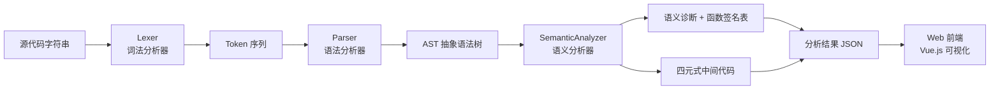

**各模块职责**：

| 模块 | 输入 | 输出 | 职责 |
|------|------|------|------|
| Lexer | 源代码字符串 | Token 序列 + 词法错误 | 字符流 → Token 流 |
| Parser | Token 序列 | AST + 语法错误 | Token 流 → 语法树 |
| **SemanticAnalyzer** | **AST** | **语义错误 + 四元式 + 函数签名表** | **类型/约束检查 + IR 生成** |
| analyze_source.py | 源代码 | JSON 结果 | 串联各阶段，桥接前端 |
| server.py | HTTP 请求 | JSON 响应 | 集成分析器，提供 API + 托管前端 |
| Web 前端 | 用户输入 | 可视化结果 | 交互展示 Token / AST / 四元式 / 诊断 |

**模块交互流程**：

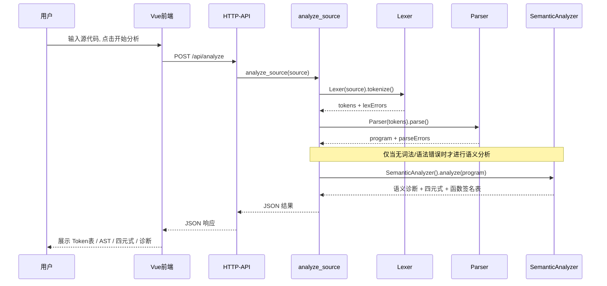

**文件结构**：

```
big_hw_2/
├── bighw2/                # Python 后端
│   ├── lexer.py           # 词法分析器（沿用大作业1）
│   ├── parser.py          # 递归下降语法分析器 + AST 定义
│   ├── semantic.py        # ★ 语义分析器 + 四元式生成器（本次新增）
│   ├── diagnostics.py     # 统一的诊断/位置数据结构
│   ├── analyze_source.py  # JSON 桥接层
│   ├── server.py          # 一体化 HTTP 服务器
│   ├── analyzer.spec      # PyInstaller 打包配置
│   ├── dist/RustAnalyzer.exe   # 打包产物
│   ├── test_lexer.py / test_parser.py / test_semantic.py   # 测试
└── frontend/              # Vue 3 + TypeScript 前端
    └── src/
        ├── App.vue
        ├── components/analyzer/
        │   ├── SourcePanel.vue       # 源代码输入面板
        │   ├── AnalysisPanel.vue     # ★ 三标签页：词法/语法/语义(四元式)
        │   ├── ErrorPanel.vue        # 诊断信息面板（含语义错误分组）
        │   └── MetricStrip.vue       # 指标条
        └── composables/useAnalyzer.ts
```

### 3、相对大作业1的演进

本次在沿用大作业1词法 / 语法成果的同时，对工程结构做了如下演进：

- **语义模块独立**：将语义分析从 `parser.py` 抽离为独立的 `semantic.py`，使"语法构建 AST"与"语义检查 + IR 生成"两类关注点彻底分离；删除了 `parser.py` 中遗留的旧语义检查器，避免双份实现产生分叉。
- **诊断结构统一**：抽出 `diagnostics.py`，用 `SourceLoc(line, column)` 与 `Diagnostic(phase, message, line, column)` 统一承载词法 / 语法 / 语义三阶段的诊断，前端可据此做精确定位。
- **AST 节点补充位置信息**：所有 AST 节点都带 `loc` 字段，使语义诊断能定位到准确的行列。
- **JSON 契约扩展**：`analyze_source` 的输出新增 `semanticDiagnostics`、`functionSignatures`、`quads` 字段，供前端"语义分析"标签使用。

---

## 三、详细设计

### 1、语义分析

#### 1.1 语义分析原理

语义分析在 AST 上进行**一次自顶向下的遍历**，借助符号表与类型系统，检查那些语法分析无法表达的约束。其核心是两件事：**符号表管理**（谁在什么作用域内可见、是否可变、是否已初始化）与**类型推断与检查**（每个表达式是什么类型、上下文要求的类型是否相容）。

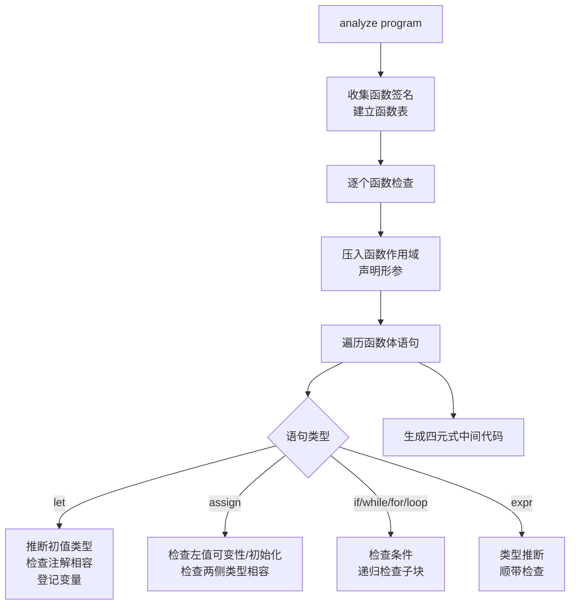

#### 1.2 符号表与作用域

符号表用一个**作用域栈** `scopes: List[Dict[str, VarInfo]]` 实现。进入函数体、语句块、循环体时压入新作用域，离开时弹出；查找变量时从栈顶向栈底逐层回溯，自然实现了**就近遮蔽（shadowing）**与块级作用域。

每个变量记录三项关键信息：

```python
@dataclass
class VarInfo:
    mutable: bool          # 是否用 mut 声明（决定能否被再次赋值）
    type_node: TypeNode    # 变量类型
    initialized: bool = True   # 是否已初始化（决定能否被读取）
```

作用域基本操作：

```python
def _declare(self, name, var, loc):
    cur = self.scopes[-1]
    if name in cur:                       # 同一作用域重复定义 → 报错
        self._report(f"变量 '{name}' 在同一作用域重复定义", loc)
        return
    cur[name] = var

def _lookup(self, name):
    for scope in reversed(self.scopes):   # 由内向外逐层查找
        if name in scope:
            return scope[name]
    return None
```

#### 1.3 类型系统与类型相容

类型节点沿用大作业1设计的继承体系，覆盖 `i32`、引用、数组、元组与"未知类型"（用于错误恢复，避免一处错误引发连锁误报）：

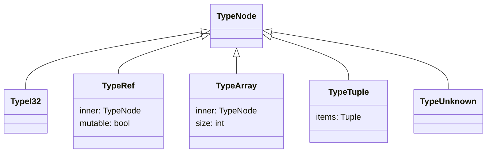

类型相容性判定 `_compatible(expected, actual)` 递归比较两类型是否一致。关键设计：**任一方为 `TypeUnknown` 时一律视为相容**，这样上游的一个类型错误不会向下游传播成一连串假错误：

```python
def _compatible(self, expected, actual):
    if isinstance(expected, TypeUnknown) or isinstance(actual, TypeUnknown):
        return True                                   # 错误恢复：未知类型放行
    if isinstance(expected, TypeI32):
        return isinstance(actual, TypeI32)
    if isinstance(expected, TypeRef):                 # 引用：可变性 + 内部类型都要一致
        return (isinstance(actual, TypeRef)
                and expected.mutable == actual.mutable
                and self._compatible(expected.inner, actual.inner))
    if isinstance(expected, TypeArray):               # 数组：长度 + 元素类型一致
        return (isinstance(actual, TypeArray)
                and expected.size == actual.size
                and self._compatible(expected.inner, actual.inner))
    if isinstance(expected, TypeTuple):               # 元组：逐项递归比较
        return (isinstance(actual, TypeTuple)
                and len(expected.items) == len(actual.items)
                and all(self._compatible(a, b) for a, b in zip(expected.items, actual.items)))
    return True
```

类型推断 `_infer_expr(expr)` 对每类表达式返回其类型，并在推断过程中顺带完成检查。例如二元运算：

```python
if isinstance(expr, BinaryExpr):
    left_type  = self._infer_expr(expr.left)
    right_type = self._infer_expr(expr.right)
    if expr.op in {"+", "-", "*", "/"}:               # 算术：两侧必须 i32
        if not self._compatible(left_type, I32) or not self._compatible(right_type, I32):
            self._report("算术运算要求两侧为 i32", expr.loc)
        return I32
    if expr.op in {"<", "<=", ">", ">=", "==", "!="}: # 比较：两侧类型相容
        if not self._compatible(left_type, right_type):
            self._report("比较运算两侧类型不兼容", expr.loc)
        return I32
    return UNKNOWN
```

#### 1.4 语义检查规则一览

语义分析器实现的检查项可归纳为下表：

| 类别 | 检查内容 | 触发示例 |
|------|---------|---------|
| 声明 | 同一作用域变量重复定义 | `let a=1; let a=2;` |
| 声明 | 函数重复定义 | 两个同名 `fn` |
| 使用 | 使用未定义变量 / 调用未定义函数 | `y = x;`（x 未声明） |
| **使用** | **使用未初始化的变量** ★ | `let x:i32; let y=x+1;` |
| 可变性 | 对不可变左值赋值 | `let a=1; a=2;` |
| 类型 | `let` 注解与初值类型不匹配 | `let b:[i32;2]=5;` |
| 类型 | 赋值两侧类型不匹配 | `a = [1,2];`（a 为 i32） |
| 类型 | `return` 值 / 尾表达式与返回类型不匹配 | `fn f()->i32 { [1,2] }` |
| 类型 | 数组字面量元素类型不一致 | `[1, [1,2]]` |
| 结构 | 下标访问非数组 / 点访问非元组 / 元组索引越界 | `t.2`（t 仅两元素） |
| 引用 | 解引用操作数不是引用 | `*a`（a 为 i32） |
| 控制流 | `for` 仅允许遍历区间或数组 | `for i in 5 {}` |
| 控制流 | `break` / `continue` 只能在循环中 | 函数体直接 `break;` |
| 控制流 | `if` 表达式两分支 / `loop` 各 `break` 值类型一致 | `if c {1} else {[1,2]}` |
| 函数 | 调用实参个数 / 类型与签名不符 | `add(1)`（需 2 参） |

#### 1.5 重点检查之一：未初始化变量与延迟初始化

这是本次新增、也是较能体现"语义分析价值"的一项检查。类 Rust 允许 `let x:i32;` 这种**先声明、后赋值**的延迟初始化写法，因此不能简单地"声明即可用"。设计思路：

- `let` **无初值**时，变量登记为 `initialized = False`；有初值时为 `True`。
- **读取**变量（出现在表达式中）时，若 `initialized == False` → 报"使用了未初始化的变量"。
- **赋值**到简单变量时：
  - 若变量当前未初始化 → 视为**首次初始化**，无论是否 `mut` 都允许，并将其置为已初始化（符合 Rust 的延迟初始化语义）；
  - 若变量已初始化 → 必须是 `mut`，否则报"对不可变左值赋值"。

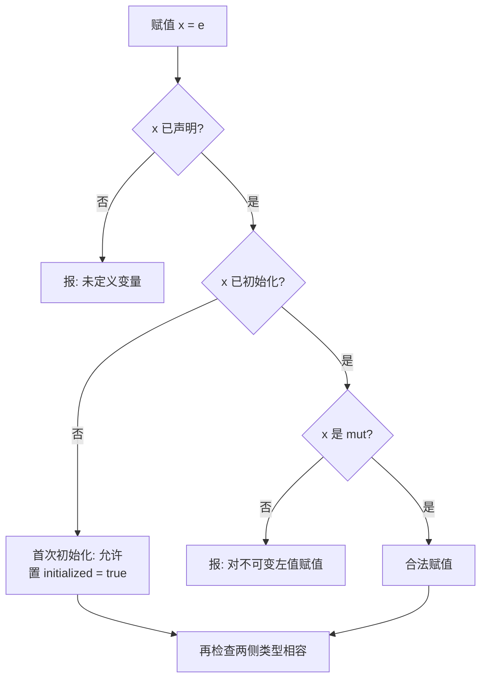

核心代码（`_check_stmt` 中 `AssignStmt` 分支）：

```python
if isinstance(stmt.target, IdentExpr):
    info = self._lookup(stmt.target.name)
    if info is None:
        self._report(f"未定义变量 '{stmt.target.name}'", stmt.target.loc)
        return
    if info.initialized and not info.mutable:        # 已初始化的不可变变量不能再赋值
        self._report("对不可变左值进行赋值", stmt.loc)
    if not self._compatible(info.type_node, rhs_type):
        self._report(..., stmt.loc)
    info.initialized = True                          # 首次赋值即完成初始化
    return
```

读取处的检查（`_infer_expr` 中 `IdentExpr` 分支）：

```python
if isinstance(expr, IdentExpr):
    info = self._lookup(expr.name)
    if info is None:
        self._report(f"使用了未定义变量 '{expr.name}'", expr.loc)
        return UNKNOWN
    if not info.initialized:
        self._report(f"使用了未初始化的变量 '{expr.name}'", expr.loc)
    return info.type_node
```

这样设计的好处是：`let y:i32; y = 5; let z = y + 1;`（先声明、再赋值、后读取）能正确放行，而 `let x:i32; let y = x + 1;`（读取了从未赋值的 x）会被精确捕获。

#### 1.6 重点检查之二：函数调用检查

语义分析采用**两遍**策略：先扫描所有函数声明，建立"函数签名表"（函数名 → 形参类型列表 + 返回类型），再逐个函数检查函数体。这样无论函数定义在调用点之前还是之后，调用检查都能找到签名（支持前向引用）。

```python
def _collect_function_signatures(self, program):
    for fn in program.functions:
        if fn.name in self.functions:
            self._report(f"函数 '{fn.name}' 重复定义", fn.loc)
            continue
        self.functions[fn.name] = FunctionSig(
            name=fn.name,
            params=[p.type_node for p in fn.params],
            return_type=fn.return_type, loc=fn.loc)
```

调用点检查实参个数与逐个实参类型，并以签名的返回类型作为调用表达式的类型：

```python
sig = self.functions.get(expr.callee.name)
if sig is None:
    self._report(f"未定义函数 '{expr.callee.name}'", expr.callee.loc); return UNKNOWN
if len(arg_types) != len(sig.params):
    self._report(f"函数 '{sig.name}' 期望 {len(sig.params)} 个参数，"
                 f"但调用提供了 {len(arg_types)} 个参数", expr.loc)
    return sig.return_type or UNKNOWN
for i, (expected, actual) in enumerate(zip(sig.params, arg_types), start=1):
    if not self._compatible(expected, actual):
        self._report(f"函数 '{sig.name}' 第 {i} 个参数类型不匹配，"
                     f"期望 {self._type_str(expected)}，实际为 {self._type_str(actual)}",
                     expr.args[i-1].loc)
```

---

### 2、中间代码生成

#### 2.1 四元式表示

中间代码采用经典的**四元式（Quadruple）**形式，每条四元式是一个四元组 `(op, arg1, arg2, result)`：

```python
@dataclass
class Quad:
    index: int       # 序号（同时充当跳转地址）
    op: str          # 操作符
    arg1: str = ""   # 操作数 1
    arg2: str = ""   # 操作数 2
    result: str = "" # 结果（或跳转目标标号）
```

生成过程依赖三类辅助：**临时变量**（`t1, t2, …`，承载子表达式结果）、**标号**（`L1, L2, …`，作为跳转目标）、以及统一的发射函数 `_emit`：

```python
def _new_temp(self):  self.temp_index += 1;  return f"t{self.temp_index}"
def _new_label(self): self.label_index += 1; return f"L{self.label_index}"

def _emit(self, op, arg1="", arg2="", result=""):
    self.quads.append(Quad(index=len(self.quads), op=op,
                           arg1=str(arg1), arg2=str(arg2), result=str(result)))
    return result
```

常用操作符约定：

| 操作符 | 含义 | 形式 |
|--------|------|------|
| `func` / `endfunc` | 函数开始 / 结束 | `(func, 名, -, -)` |
| `param` | 形参声明 | `(param, 类型, mut?, 名)` |
| `+ - * /` `< <= > >= == !=` | 算术 / 比较 | `(op, a, b, t)` |
| `=` | 赋值 / 复制 | `(=, src, -, dst)` |
| `jz` | 为零（假）跳转 | `(jz, cond, -, L)` |
| `jmp` | 无条件跳转 | `(jmp, -, -, L)` |
| `label` | 标号占位 | `(label, -, -, L)` |
| `arg` / `call` | 传参 / 调用 | `(call, 函数名, 实参个数, t)` |
| `return` | 返回 | `(return, 值, -, -)` |
| `[]` / `.` | 下标 / 字段取值 | `([], base, idx, t)` |
| `array` / `tuple` | 构造数组 / 元组 | 配合 `array_set` / `tuple_set` |

#### 2.2 表达式翻译

表达式翻译 `_gen_expr` 返回该表达式结果所在的"位置"（字面量、变量名或临时变量）。叶子结点直接返回其文本；复合表达式先递归翻译子表达式，再发射一条以新临时变量为结果的四元式。以二元表达式为例：

```python
if isinstance(expr, BinaryExpr):
    left  = self._gen_expr(expr.left)
    right = self._gen_expr(expr.right)
    target = self._new_temp()
    self._emit(expr.op, left, right, target)   # (op, left, right, t)
    return target
```

#### 2.3 控制流翻译

控制流是中间代码生成的难点，核心手法是**用标号与跳转把结构化控制流"拍平"成线性序列**。

**`while` 循环**的翻译模式——"测试在前，回跳在后"：

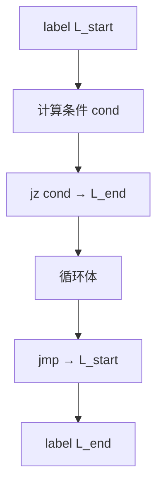

```python
def _gen_while_stmt(self, stmt):
    start_label, end_label = self._new_label(), self._new_label()
    self._emit("label", "", "", start_label)
    cond = self._gen_expr(stmt.condition)
    self._emit("jz", cond, "", end_label)            # 条件假 → 跳出
    self.loop_controls.append({"break": end_label, "continue": start_label, "result": None})
    self._gen_block(stmt.body)
    self.loop_controls.pop()
    self._emit("jmp", "", "", start_label)           # 回跳到测试
    self._emit("label", "", "", end_label)
```

**`for i in a..b` 区间循环**被翻译为"初始化 + 条件 + 自增"的等价结构：以 `i = a` 初始化，每轮测试 `i < b`，循环体之后在 `continue` 标号处执行 `i = i + 1` 再回跳——这样 `continue` 跳到自增处而非测试处，保证迭代变量正确递进。

**`break` / `continue` 的目标管理**：用一个 `loop_controls` 栈保存当前循环的 `break` 标号（循环出口）与 `continue` 标号（继续点）。遇到 `break` 发射 `jmp → break标号`，遇到 `continue` 发射 `jmp → continue标号`；若不在任何循环内则报语义错误。`loop` 表达式还会把 `break value` 的值写入循环结果临时变量，从而支持 `let x = loop { break 5; };` 这类带值循环。

```python
if isinstance(stmt, BreakStmt):
    value = self._gen_expr(stmt.value) if stmt.value is not None else ""
    if self.loop_controls:
        result_target = self.loop_controls[-1].get("result")
        if value and result_target:
            self._emit("=", value, "", result_target)   # loop 表达式的返回值
        self._emit("jmp", "", "", self.loop_controls[-1]["break"])
```

**`if` 语句**采用 `jz` 跳过 then 块、`jmp` 跨过 else 块的标准模式，并对 `else if` 链做递归翻译。

#### 2.4 函数调用约定

函数调用按"先压实参、再调用"的约定翻译：每个实参发射一条 `arg`，随后 `call` 携带被调函数名与实参个数，结果落在新临时变量中。函数定义则以 `func` 开头、`param` 逐个声明形参、`endfunc` 收尾；带返回类型的函数体尾表达式自动补一条 `return`。

```python
if isinstance(expr, CallExpr):
    args = [self._gen_expr(a) for a in expr.args]
    for a in args:
        self._emit("arg", a, "", "")
    target = self._new_temp()
    self._emit("call", expr.callee.name, str(len(args)), target)
    return target
```

#### 2.5 翻译实例

**实例一：`for` 区间循环 + 赋值**

输入：

```rust
fn program_5_2(mut n:i32) {
    for mut i in 1..n+1 {
        n = n - 1;
    }
}
```

生成的四元式序列：

| # | op | arg1 | arg2 | result | 说明 |
|:-:|----|------|------|--------|------|
| 0 | func | program_5_2 | - | - | 函数开始 |
| 1 | param | i32 | mut | n | 形参 n |
| 2 | + | n | 1 | t1 | 计算区间上界 n+1 |
| 3 | = | 1 | - | i | 迭代变量初始化 i=1 |
| 4 | label | - | - | L1 | 循环测试入口 |
| 5 | < | i | t1 | t2 | i < n+1 |
| 6 | jz | t2 | - | L3 | 条件假 → 跳出 |
| 7 | - | n | 1 | t3 | 循环体 n-1 |
| 8 | = | t3 | - | n | n = n-1 |
| 9 | label | - | - | L2 | continue 继续点 |
| 10 | + | i | 1 | t4 | i+1 |
| 11 | = | t4 | - | i | i = i+1 |
| 12 | jmp | - | - | L1 | 回跳测试 |
| 13 | label | - | - | L3 | 循环出口 |
| 14 | endfunc | program_5_2 | - | - | 函数结束 |

前端实际渲染效果（语义分析标签页）：

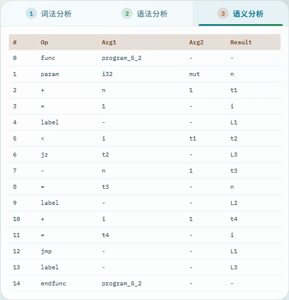

**实例二：函数定义与调用**

输入：

```rust
fn add(a:i32, b:i32) -> i32 {
    a + b
}
fn main() {
    let s:i32 = add(1, 2);
}
```

生成的四元式序列：

| # | op | arg1 | arg2 | result | 说明 |
|:-:|----|------|------|--------|------|
| 0 | func | add | - | - | add 开始 |
| 1 | param | i32 | - | a | 形参 a |
| 2 | param | i32 | - | b | 形参 b |
| 3 | + | a | b | t1 | a+b |
| 4 | return | t1 | - | - | 返回尾表达式 |
| 5 | endfunc | add | - | - | add 结束 |
| 6 | func | main | - | - | main 开始 |
| 7 | arg | 1 | - | - | 压入实参 1 |
| 8 | arg | 2 | - | - | 压入实参 2 |
| 9 | call | add | 2 | t2 | 调用 add，2 个实参 |
| 10 | = | t2 | - | s | s = 返回值 |
| 11 | endfunc | main | - | - | main 结束 |

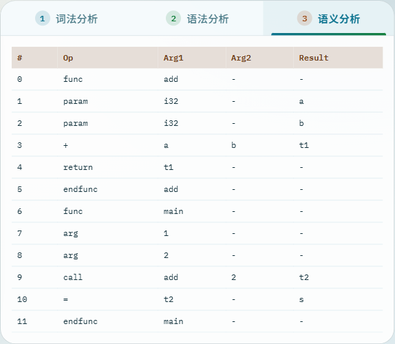

**实例三：`while` 嵌套 `if`** —— 体现标号的层层嵌套：

```rust
fn f(mut n:i32) {
    while n > 0 {
        if n == 1 { n = n - 1; }
    }
}
```

```
 0 func    f                 5 ==     n      1   t2
 1 param   i32   mut  n       6 jz     t2     -   L3
 2 label   -     -    L1      7 -      n      1   t3
 3 >       n     0    t1      8 =      t3     -   n
 4 jz      t1    -    L2      9 label  -      -   L3
                             10 jmp    -      -   L1
                             11 label  -      -   L2
                             12 endfunc f     -   -
```

可见 `while` 的出口标号 `L2` 与内层 `if` 的出口标号 `L3` 互不干扰，标号分配的全局递增保证了正确性。

---

### 3、可视化设计

#### 3.1 三标签页结构

前端把分析结果组织为与编译流程一致的**三个阶段标签页**，新增的"③ 语义分析"标签展示四元式中间代码表：

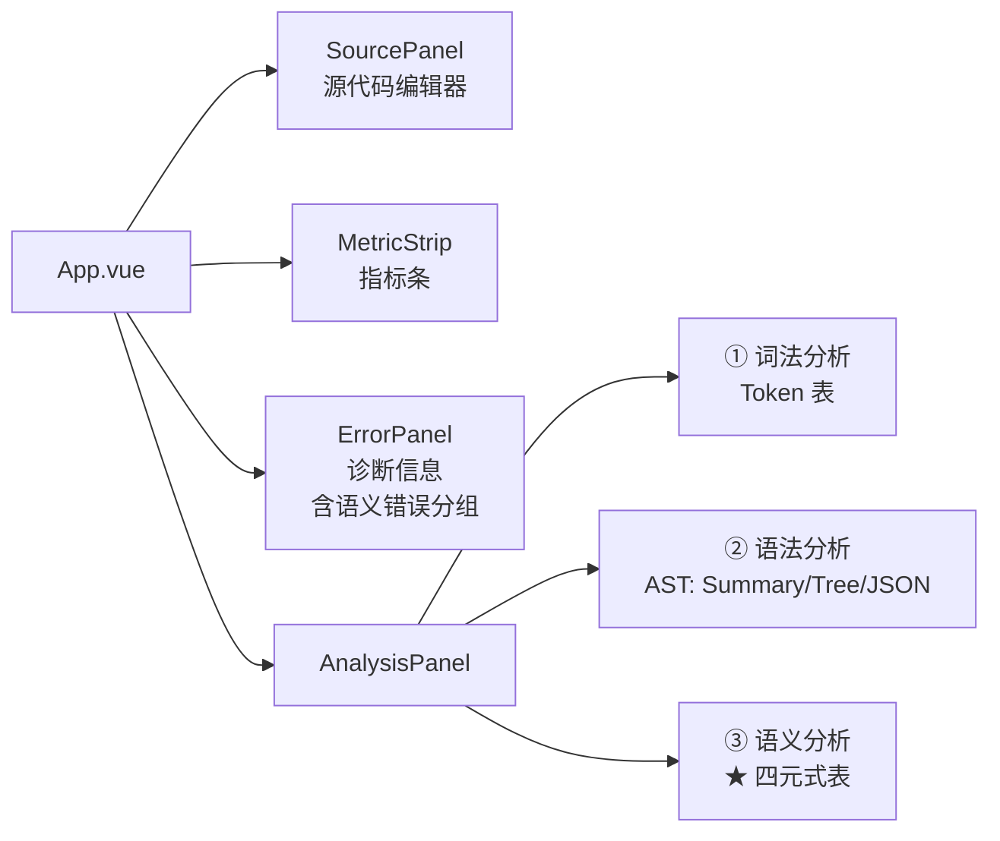

#### 3.2 分阶段门控逻辑

当某一前序阶段存在错误时，后续阶段的结果不可信，前端据错误状态对各标签的内容进行门控：四元式仅在"无词法、无语法、无语义错误"时才展示，否则显示对应阶段的"存在错误"提示卡，引导用户先修复。

```python
showTokenTable = hasResult and not hasLexErrors
showAst        = showTokenTable and not hasParseErrors
showQuads      = showAst and not hasSemanticErrors    # 四元式：全部通过才生成
```

#### 3.3 四元式表渲染

语义分析标签以表格渲染四元式，列为 `#`、`Op`、`Arg1`、`Arg2`、`Result`，空操作数以 `-` 占位，整体采用与词法/语法标签区分的暖色配色，呼应"第三阶段"的橙色徽章。

---

## 四、运行效果展示

**整体界面**：左栏为源代码编辑器与诊断信息面板，右栏为三标签分析面板，顶部指标条实时显示 Token 数量与各阶段错误计数。下图为分析一段正确程序后的整体界面：

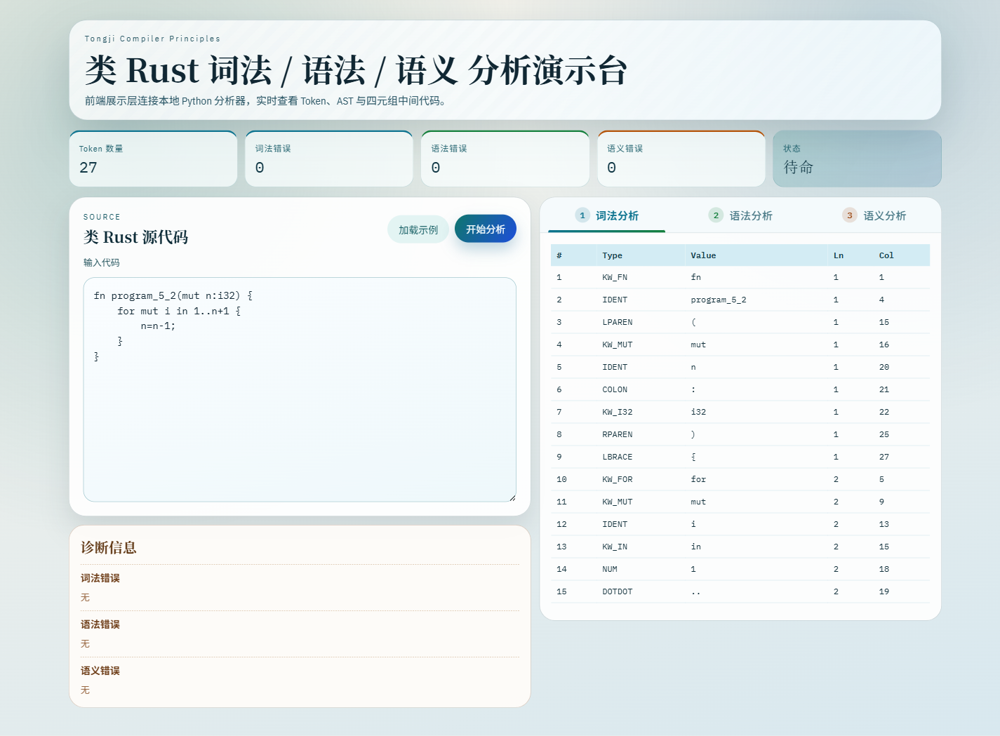

**未初始化变量检查**：输入 `let x:i32; let y:i32; y = x + 1;`，x 从未被赋值便参与运算，语义分析精确报出"使用了未初始化的变量 'x'"并标注行列：


**多类语义错误**：下例同时触发四类不同的语义错误——不可变赋值、`let` 类型不匹配、函数实参个数不符、调用未定义函数，诊断面板逐条列出并标注精确位置：

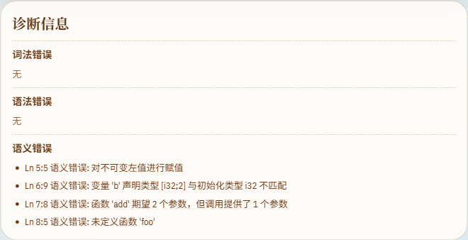

```rust
fn add(a: i32, b: i32) -> i32 { a + b }
fn main() {
    let a: i32 = 1;
    a = 2;                 // 对不可变左值赋值
    let b: [i32; 2] = 5;   // 类型不匹配
    add(1);                // 实参个数不符
    foo(3);                // 未定义函数
}
```

---

## 五、测试结果

为词法、语法 / 语义、以及独立的语义分析器分别编写了单元测试，覆盖类型检查、可变性、初始化、控制流约束、函数调用、四元式生成等各个方面，全部通过：

```text
$ python test_lexer.py
Result: 78/78 passed

$ python test_parser.py
Result: 152/152 passed

$ python test_semantic.py
Semantic result: 25/25 passed
```

其中 `test_semantic.py` 专门覆盖本次新增能力，包括：变量重复定义、未初始化 / 未定义变量、不可变赋值、各类类型不匹配、`break`/`continue` 越界、数组元素类型、元组越界、`if` 表达式分支类型、函数签名收集顺序，以及算术 / 函数调用 / `while`+`if` / `for` 区间 / 数组与元组访问等多种四元式生成场景。

---

## 六、小组分工

| 学号 | 姓名 | 主要分工 |
|------|------|---------|
| 2350231 | 高柏舟 | 语义分析器（符号表 / 类型系统 / 初始化检查）+ 测试用例 |
| 2350999 | 殷和尘 | 中间代码生成（四元式 / 控制流翻译）+ 后端桥接层 |
| 2352831 | 李政翰 | 前端语义分析标签与四元式表 + 打包 exe + 测试用例 |

> 注：报告由三人共同完成；语义分析与中间代码生成在 `semantic.py` 中协同实现，部分检查与翻译逻辑由组员交叉补充完善。

---

## 七、总结和展望

### 1、总结

本次大作业2在大作业1词法 / 语法分析的基础上，完成了编译器中后端的两大核心组件：

- **语义分析器**：基于作用域栈的符号表 + 类型系统，实现了变量重复定义、未定义 / **未初始化变量使用**、不可变赋值（含**延迟初始化**语义）、类型匹配、`for` 可迭代性、`break`/`continue` 位置、函数重复定义与**函数调用参数检查**等十余类静态语义约束，全部诊断带精确行列号。
- **中间代码生成器**：以四元式为目标，实现了表达式翻译与临时变量分配、完整的控制流翻译（`if` / `while` / `for` / `loop` / `break` / `continue` 的标号与跳转）、以及函数调用约定，可将语义合法的程序翻译为线性的四元式序列。
- **工程结构演进**：将语义分析独立为 `semantic.py`，统一诊断结构，扩展 JSON 契约，并在前端新增"语义分析"标签可视化四元式。后端测试共 255 个用例全部通过。

### 2、展望

- **数据流敏感的初始化分析**：当前初始化检查为顺序近似，可引入控制流图做更精确的"definite assignment"分析，处理分支中部分初始化的情形。
- **中间代码优化**：可在四元式上实施常量折叠、复写传播、死代码消除等基础优化。
- **目标代码生成**：以四元式为输入，进一步生成栈式虚拟机指令或类汇编目标代码。
- **类型系统扩展**：引入布尔类型区分条件表达式与算术结果，并支持更完整的引用借用与生命周期检查。

---

## 八、参考文献

[1] 陈火旺, 刘春林, 谭庆平, 等. 程序设计语言编译原理（第4版）[M]. 北京: 国防工业出版社, 2010.

[2] Alfred V. Aho, Monica S. Lam, Ravi Sethi, Jeffrey D. Ullman. Compilers: Principles, Techniques, and Tools (2nd Edition) [M]. Pearson, 2006.

[3] 知乎专栏. "编译原理：语义分析与中间代码生成" [EB/OL]. 知乎技术专栏, 2022.

[4] Steve Klabnik, Carol Nichols, Rust Community. The Rust Programming Language [EB/OL]. 2023. https://doc.rust-lang.org/book/

[5] Overview of the compiler - Rust Compiler Development Guide [EB/OL]. 2023. https://rustc-dev-guide.rust-lang.org/overview.html

[6] Vue.js Official Documentation [EB/OL]. https://vuejs.org/

[7] Mermaid Official Documentation [EB/OL]. https://mermaid.js.org/
